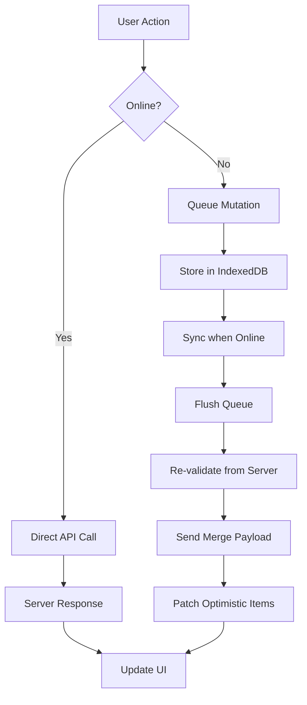
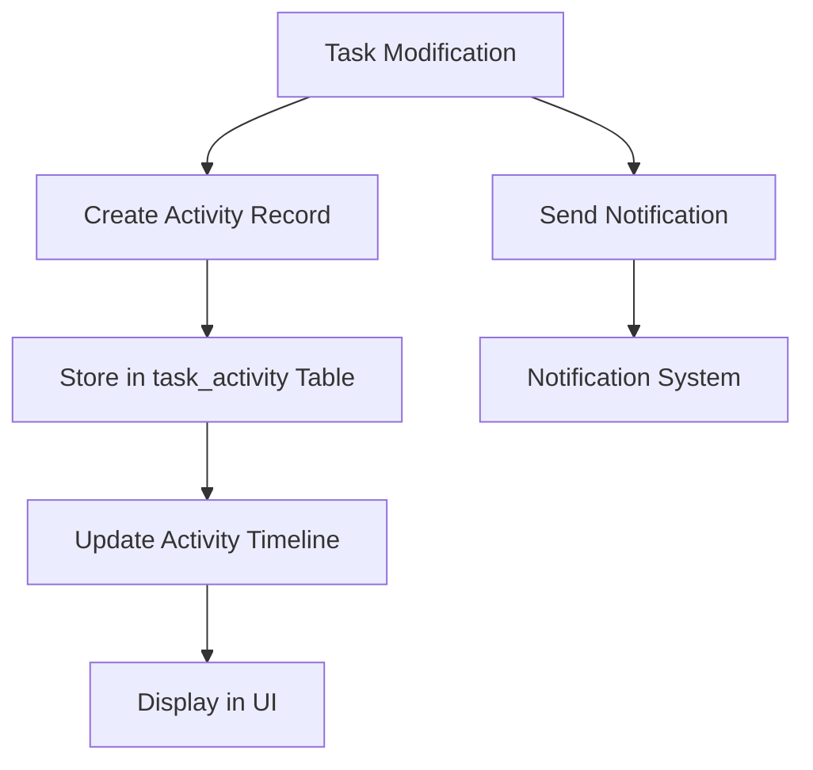
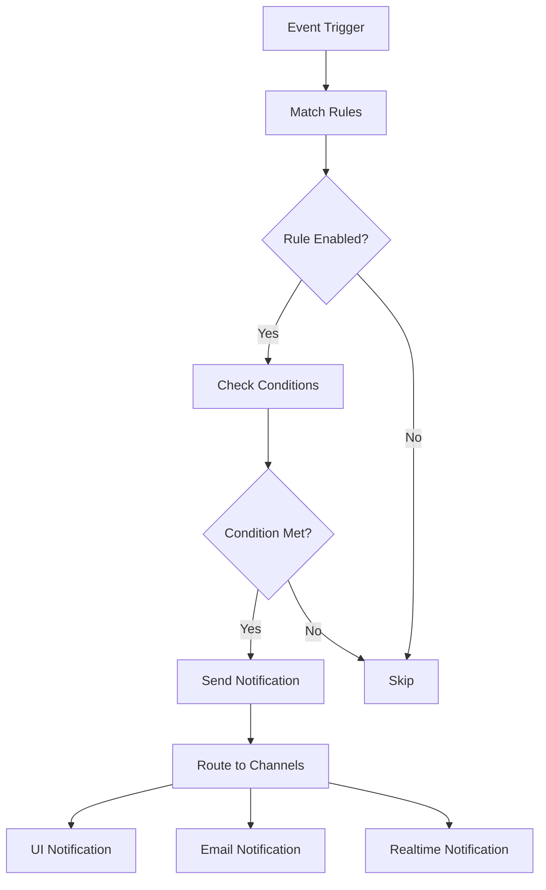
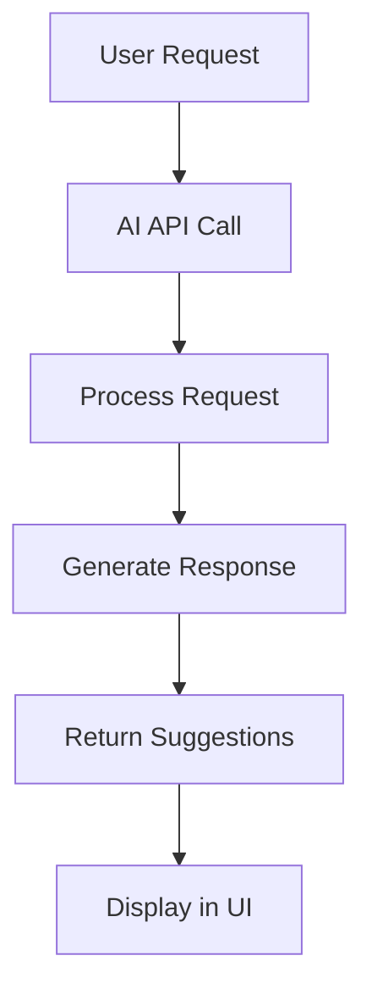
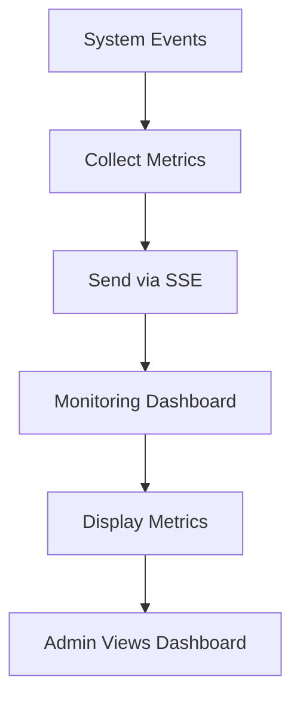

# M6 Phase: New Endpoints and Architecture Summary

## 🔄 New API Endpoints

### AI Assistant Endpoints
- `POST /api/ai/generate-task` - Generate task suggestions
- `POST /api/ai/summarize-notifications` - Summarize notifications

### Document Locking Endpoints
- `POST /api/locks/acquire` - Acquire task edit lock
- `POST /api/locks/release` - Release task edit lock
- `GET /api/locks/subscribe` - SSE endpoint for lock updates

### Monitoring Endpoints
- `GET /api/monitoring/events` - SSE endpoint for monitoring events
- `POST /api/monitoring/errors` - Report browser console errors

### Task Activity Endpoints
- `GET /api/tasks/[id]/activity` - Get task activity timeline

## 🏗️ Architecture Diagrams

### Local-First Architecture Flow



### Document Locking Flow

```mermaid
graph TD
    A[User Opens Task] --> B[Acquire Lock]
    B --> C{Lock Available?}
    C -->|Yes| D[Grant Lock]
    C -->|No| E[Show "Someone Editing" Badge]
    D --> F[Disable Conflicting Inputs]
    F --> G[User Edits Task]
    G --> H[Auto-release on Unload]
    H --> I[Release Lock]
    E --> J[User Waits]
    J --> K[Periodic Lock Check]
    K --> C
```

### Task Activity Timeline Flow



### Notification Rules Engine Flow



### AI Assistant Flow



### Admin Monitoring Flow



## 🗃️ Database Schema Changes

### New Tables

#### editLocks
```sql
CREATE TABLE IF NOT EXISTS edit_locks (
  id INTEGER PRIMARY KEY AUTOINCREMENT,
  task_id INTEGER NOT NULL REFERENCES tasks(id),
  user_id INTEGER NOT NULL REFERENCES users(id),
  acquired_at TEXT NOT NULL,
  expires_at TEXT NOT NULL,
  created_at TEXT NOT NULL
);
```

#### taskActivity
```sql
CREATE TABLE IF NOT EXISTS task_activity (
  id INTEGER PRIMARY KEY AUTOINCREMENT,
  task_id INTEGER NOT NULL REFERENCES tasks(id),
  user_id INTEGER NOT NULL REFERENCES users(id),
  action TEXT NOT NULL, -- 'created', 'status_changed', 'review_changed', 'assigned', 'moved', 'commented'
  old_value TEXT,
  new_value TEXT,
  metadata TEXT, -- JSON data for additional context
  created_at TEXT NOT NULL
);
```

### Modified Tables

#### tasks
- Added index on `version` column for optimistic concurrency control

#### notifications
- Added `channel` column for notification channels

## 🧩 Component Architecture

### Local Storage Layer
```
src/lib/localStore/
├── localDB.ts          # IndexedDB wrapper
├── persistedQueries.ts # API response caching
├── offlineQueue.ts     # Offline mutation queue
└── syncEngine.ts       # Online/offline synchronization
```

### Real-time Components
```
src/components/
├── AI/
│   └── AssistantPanel.tsx    # AI assistant UI
├── TaskActivity.tsx          # Task timeline display
├── MonitoringDashboard.tsx   # Admin monitoring UI
└── SSEStatusBadge.tsx        # Connection status indicator
```

### Hooks
```
src/hooks/
├── usePresence.ts      # Presence tracking with optimized scheduling
└── useServerSync.ts    # SSE/WebSocket connection management
```

## 🧪 Test Infrastructure

### New Test Files
```
e2e/playwright/
├── ai-assistant.spec.ts      # AI assistant tests
├── monitoring.spec.ts        # Admin monitoring tests
├── perf.spec.ts              # Performance tests
├── offline.spec.ts           # Offline mode tests
├── locks.spec.ts             # Document locking tests
├── task-activity.spec.ts     # Task timeline tests
└── notification-rules.spec.ts # Notification rules tests
```

### Test Helpers
```
e2e/playwright/helpers/
├── simulateOffline.ts        # Offline mode simulation
├── toggleFeatureFlag.ts      # Feature flag management
├── seedLocks.ts             # Document locking test data
├── seedTimeline.ts          # Task activity test data
└── seedOfflineMutations.ts  # Offline mutation test data
```

## 🚀 Performance Optimizations

1. **Bundle Splitting**: Lazy loading for large components
2. **Progressive Loading**: Infinite scroll with batch loading
3. **Resource Scheduling**: requestIdleCallback for non-critical operations
4. **Background Sync**: Defer presence updates to Background Sync API
5. **Cache Eviction**: Automatic clearing of query cache after sync

## 🔒 Security Considerations

1. All new endpoints follow existing RBAC patterns
2. Admin-only access to monitoring features
3. Proper authentication and authorization for all endpoints
4. Secure handling of offline data with encryption at rest (if implemented)

## 🛠️ Maintenance Features

1. Regular cache eviction to prevent storage bloat
2. Monitoring of offline queue for stuck mutations
3. Periodic cleanup of expired locks
4. Review of notification rules for relevance and performance

This comprehensive architecture provides a robust foundation for enterprise-grade offline-first functionality with real-time collaboration features.