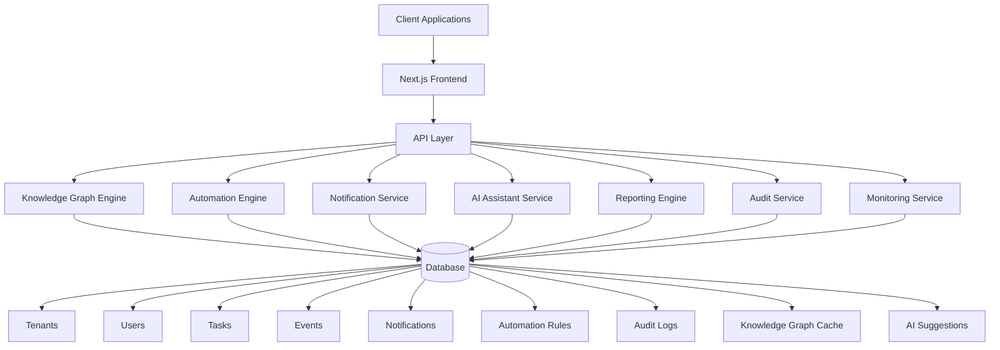

# M7 Architecture Diagram

```mermaid
graph TB
    A[Client Applications] --> B[Next.js Frontend]
    B --> C[API Layer]
    C --> D[Knowledge Graph Engine]
    C --> E[Automation Engine]
    C --> F[Notification Service]
    C --> G[AI Assistant Service]
    C --> H[Reporting Engine]
    C --> I[Audit Service]
    C --> J[Monitoring Service]
    D --> K[(Database)]
    E --> K
    F --> K
    G --> K
    H --> K
    I --> K
    J --> K
    K --> L[Tenants]
    K --> M[Users]
    K --> N[Tasks]
    K --> O[Events]
    K --> P[Notifications]
    K --> Q[Automation Rules]
    K --> R[Audit Logs]
    K --> S[Knowledge Graph Cache]
    K --> T[AI Suggestions]
```