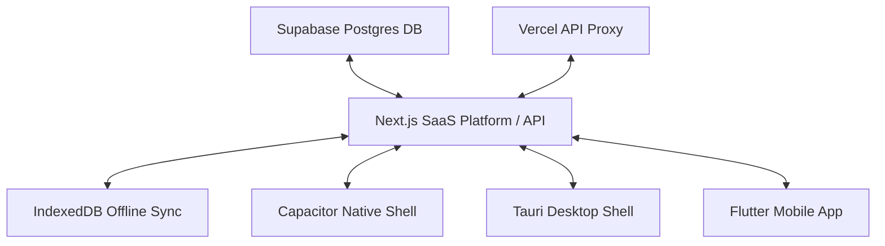

# MediaHive Unified Master Blueprint

This document is the unified source of truth and system memory for the **MediaHive** project across all platform surfaces.

---

## 1. Project Directory & Blueprint Mapping

The MediaHive ecosystem consists of three major application surfaces. Each maintains its own detailed platform blueprint:

| Platform | Directory | Platform Blueprint Path |
| :--- | :--- | :--- |
| **Web App / Core API** | `D:\MediaHive App\` | [website/MASTER_BLUEPRINT.md](file:///D:/MediaHive%20App/website/MASTER_BLUEPRINT.md) |
| **Mobile App (Flutter)** | `D:\MediaHive App\mediahive_mobile\` | [mediahive_mobile/MEDIAHIVE_MOBILE_BLUEPRINT.md](file:///D:/MediaHive%20App/mediahive_mobile/MEDIAHIVE_MOBILE_BLUEPRINT.md) |
| **Desktop App (Tauri)** | `D:\MediaHive App\MediaHive Windows app\` | [MediaHive Windows app/MASTER_BLUEPRINT.md](file:///D:/MediaHive%20App/MediaHive%20Windows%20app/MASTER_BLUEPRINT.md) |

---

## 2. Core Architecture Overview

```mermaid
graph TD
    A[Supabase Postgres DB] <--> B[Next.js SaaS Platform / API]
    B <--> C[IndexedDB Offline Sync]
    B <--> D[Capacitor Native Shell]
    B <--> E[Tauri Desktop Shell]
    B <--> F[Flutter Mobile App]
    G[Vercel API Proxy] <--> B
```

### Next.js Core SaaS Platform (Root Workspace)
* **Framework**: Next.js App Router (`^16.0.7`) + React (`^19.2.1`).
* **Database & ORM**: Drizzle ORM + Supabase Postgres (SQLite `dev.db` for local testing).
* **Local State & Offline Cache**: TanStack React Query + Dexie / IndexedDB for offline-first state sync.
* **Mobile Compilation**: Capacitor (`^7.4.4`) wrapping the built web build.

### Marketing Showcase (`website/`)
* **Framework**: Vite + Three.js + GSAP + Lenis scroll engine for 3D procedural WebGL.
* **Synthesizer**: Web Audio API programmatic synth.

### Desktop Wrapper (`MediaHive Windows app/`)
* **Framework**: Tauri v2.11.2 (Rust shell) hosting the Next.js SPA.

### Mobile Application (`mediahive_mobile/`)
* **Framework**: Flutter client communicating with Supabase and Vercel Proxy.

---

## 3. Critical Constraints & Workarounds

### 🔒 Capacitor `/api/` Relative Path Constraint
* **Context**: Capacitor mobile packages are served from `localhost` / `capacitor://localhost`. Relative fetches like `/api/tasks` default to local device storage and fail.
* **Workaround**: Every API request must pass through the `apiClient` wrapper, which dynamically prepends the correct absolute backend base URL (e.g. `https://thaiba-garden-media-manager.vercel.app`).
* **Linter Rule**: The ESLint custom rule `no-restricted-syntax` bans all direct `/api/` string and template literals.
* **Workaround Syntax**: To pass the static linter check without string concatenation obfuscation:
  * Import `API_BASE` from `@/lib/api-utils` (defined as `'/api'` without a trailing slash, which does not trigger the literal matcher).
  * Use template literals: `apiClient(`${API_BASE}/endpoint`)` or `apiClient(`${API_BASE}/endpoint/${id}`)`

### 🔑 Access Token Refresh (Direct REST APIs)
* **Context**: Direct REST endpoints called via `http` or `dio` in mobile (e.g. offline sync, chat, upload) read `accessToken` directly from `currentSession` without checking for expiration. Since these bypass the Supabase client wrapper, they fail with `401/403` once the token expires (typically after 1 hour).
* **Workaround**: Future modifications must route requests through a token refresh wrapper that calls `await Supabase.instance.client.auth.refreshSession()` if the current session is expired.
# MediaHive Unified Master Blueprint

This document is the unified source of truth and system memory for the **MediaHive** project across all platform surfaces.

---

## 1. Project Directory & Blueprint Mapping

The MediaHive ecosystem consists of three major application surfaces. Each maintains its own detailed platform blueprint:

| Platform | Directory | Platform Blueprint Path |
| :--- | :--- | :--- |
| **Web App / Core API** | `D:\MediaHive App\` | [website/MASTER_BLUEPRINT.md](file:///D:/MediaHive%20App/website/MASTER_BLUEPRINT.md) |
| **Mobile App (Flutter)** | `D:\MediaHive App\mediahive_mobile\` | [mediahive_mobile/MEDIAHIVE_MOBILE_BLUEPRINT.md](file:///D:/MediaHive%20App/mediahive_mobile/MEDIAHIVE_MOBILE_BLUEPRINT.md) |
| **Desktop App (Tauri)** | `D:\MediaHive App\MediaHive Windows app\` | [MediaHive Windows app/MASTER_BLUEPRINT.md](file:///D:/MediaHive%20App/MediaHive%20Windows%20app/MASTER_BLUEPRINT.md) |

---

## 2. Core Architecture Overview

```mermaid
graph TD
    A[Supabase Postgres DB] <--> B[Next.js SaaS Platform / API]
    B <--> C[IndexedDB Offline Sync]
    B <--> D[Capacitor Native Shell]
    B <--> E[Tauri Desktop Shell]
    B <--> F[Flutter Mobile App]
    G[Vercel API Proxy] <--> B
```

### Next.js Core SaaS Platform (Root Workspace)
* **Framework**: Next.js App Router (`^16.0.7`) + React (`^19.2.1`).
* **Database & ORM**: Drizzle ORM + Supabase Postgres (SQLite `dev.db` for local testing).
* **Local State & Offline Cache**: TanStack React Query + Dexie / IndexedDB for offline-first state sync.
* **Mobile Compilation**: Capacitor (`^7.4.4`) wrapping the built web build.

### Marketing Showcase (`website/`)
* **Framework**: Vite + Three.js + GSAP + Lenis scroll engine for 3D procedural WebGL.
* **Synthesizer**: Web Audio API programmatic synth.

### Desktop Wrapper (`MediaHive Windows app/`)
* **Framework**: Tauri v2.11.2 (Rust shell) hosting the Next.js SPA.

### Mobile Application (`mediahive_mobile/`)
* **Framework**: Flutter client communicating with Supabase and Vercel Proxy.

---

## 3. Critical Constraints & Workarounds

### 🔒 Capacitor `/api/` Relative Path Constraint
* **Context**: Capacitor mobile packages are served from `localhost` / `capacitor://localhost`. Relative fetches like `/api/tasks` default to local device storage and fail.
* **Workaround**: Every API request must pass through the `apiClient` wrapper, which dynamically prepends the correct absolute backend base URL (e.g. `https://thaiba-garden-media-manager.vercel.app`).
* **Linter Rule**: The ESLint custom rule `no-restricted-syntax` bans all direct `/api/` string and template literals.
* **Workaround Syntax**: To pass the static linter check without string concatenation obfuscation:
  * Import `API_BASE` from `@/lib/api-utils` (defined as `'/api'` without a trailing slash, which does not trigger the literal matcher).
  * Use template literals: `apiClient(`${API_BASE}/endpoint`)` or `apiClient(`${API_BASE}/endpoint/${id}`)`

### 🔑 Access Token Refresh (Direct REST APIs)
* **Context**: Direct REST endpoints called via `http` or `dio` in mobile (e.g. offline sync, chat, upload) read `accessToken` directly from `currentSession` without checking for expiration. Since these bypass the Supabase client wrapper, they fail with `401/403` once the token expires (typically after 1 hour).
* **Workaround**: Future modifications must route requests through a token refresh wrapper that calls `await Supabase.instance.client.auth.refreshSession()` if the current session is expired.

### 🏢 Cross-Tenant RLS Leak in Presence Log Migrations
* **Context**: Policies in `supabase/migrations/20260615_presence_verification.sql` for tables `presence_logs` and `field_work_sessions` allow any authenticated manager/admin to read and write records, checking role only.
* **Vulnerability**: Managers/admins in Organization A can query or modify presence data for employees in Organization B.
* **Workaround**: Policies must be updated in a future database migration to check that the manager's/admin's `tenant_id` matches the tenant of the log owner.

---

## 4. Unified Changelog
| Date | Platform / Component | Description | Author |
| :--- | :--- | :--- | :--- |
| 2026-07-15 | Mobile / Bug Fix | **Version 1.2.6-beta+106008 Release**: After OTA + reopen, Supabase fires `AuthChangeEvent.initialSession` (not `signedIn`) when restoring a persisted session from secure storage. The `onAuthStateChange` fallback listener only checked `signedIn` and `tokenRefreshed`, so already-logged-in users never triggered the session resume and the tracker never started. Fixed by adding `initialSession` to the handled event types. | AI Agent |
| 2026-07-15 | Mobile / Bug Fix | **Version 1.2.6-beta+104007 Release**: Fixed two stacked bugs in session resume: (1) `nfc_tags` lookup used `.eq('tagId', ...)` but `attendance.nfcTagId` is the UUID primary key — should be `.eq('id', ...)`. This caused `tagData` to always return null so `startTracking()` was never called. (2) `auth.currentUser` is null immediately at startup because Supabase restores sessions asynchronously — code now falls back to listening to `onAuthStateChange` for `signedIn`/`tokenRefreshed` before attempting resume. Both bugs together fully prevented the presence tracker from ever starting after OTA/reboot. | AI Agent |
| 2026-07-15 | Mobile / Bug Fix | **Version 1.2.6-beta+102006 Release**: Fixed a silent database column naming exception in `main.dart` and `background_presence_service.dart` where Supabase queries used snake_case (`user_id`, `status`, `check_in_time`, `is_within_geofence`) but the backend table schema utilizes camelCase (`userId`, `attendanceState`, `checkInTime`, `isWithinGeofence`). This successfully restores active check-in session resuming and background presence log reporting. Pushed build `102006` to trigger OTA. | AI Agent |
| 2026-07-15 | Mobile / Bug Fix | **Version 1.2.6-beta+100005 Release**: Overrode the background presence tracker's default leaf notification icon by copying our monochrome bee badge to `ic_bg_service_small.png` across all drawable density buckets (which is what the `flutter_background_service` package defaults to native-side). Pushed version `100005` to bypass the user's device running `100003`, and resolved client permission issues for `app_max_client_build` by creating custom UPDATE and INSERT RLS policies on the `system_config` table in Supabase. | AI Agent |
| 2026-07-15 | Mobile / Bug Fix | **Fix: Notification Icon (Leaf → Hexagonal Bee Logo)**: Replaced the outdated leaf-silhouette notification status bar icons (`ic_stat_notification.png`) across all 5 density buckets (`mdpi`, `hdpi`, `xhdpi`, `xxhdpi`, `xxxhdpi`) with a clean, high-quality monochrome silhouette of the MediaHive hexagonal bee logo generated from `ic_launcher_drawable.png`. This ensures all foreground service and local notifications display the correct MediaHive branding. | AI Agent |
| 2026-07-14 | Mobile / Release | **Version 1.2.6-beta+93002 Release**: Bumped version to `1.2.6-beta+93002` (build number 93002), updated `release_app.py` notes for the Gravatar fix and local crash logging system, compiled release split APKs via Flutter, published release tag `v1.2.6-beta-93002` with the arm64-v8a APK asset to GitHub, and updated the Supabase `system_config` table with the new OTA release parameters. | AI Agent |
| 2026-07-14 | Mobile / Bug Fix | **Graceful Avatar Image Loading**: Resolved an unhandled exception when loading the Gravatar network image in `global_header.dart`. Added state `_avatarLoadFailed` and `onBackgroundImageError` to catch load errors, displaying a fallback `LucideIcons.user` icon and resetting the error state dynamically if the avatar URL or local profile image path changes. | AI Agent |
| 2026-07-14 | Mobile / Feature | **Local Crash Logging & Diagnostic System**: Implemented a complete on-device crash log capture system. Wrapped all main isolate initialization and `runApp()` in a unified `runZonedGuarded` to capture asynchronous, render, and zone-level exceptions. Persists logs synchronously via `writeAsStringSync` containing detailed stack traces and device metadata (OS version, device model, app build). Logs auto-rotate after 3 days or a 50-file cap. Added a `CrashLogsScreen` under System Health settings with swipable logs list, detail trace viewer, confirmation dialogs, and native log sharing (`share_plus`). Added a long-press debug test crash trigger to System Health screen (enabled for all modes in release build `74002` and `76002` to allow device verification). | AI Agent |
| 2026-07-14 | Mobile / Bug Fix | **Crash Fix: Post Check-In TypeError**: Resolved a critical runtime crash immediately following successful attendance scans. Fixed rigid `as double` casts on coordinate properties in `_processTagScan` inside `attendance_provider.dart` to safe `(as num).toDouble()` conversions, preventing crashes when Supabase yields integer coordinates (e.g. `25` instead of `25.0`). | AI Agent |
| 2026-07-13 | Mobile / Bug Fix | **QR Scan Signature Verification & Web Double-Encoding Fix**: Resolved the "Invalid QR code" issue by unifying deep-link URL payloads with backend HMAC-SHA256 signatures. Fixed a double-encoding bug on the web admin page where `&sig=` was truncated, and routed the `sig` token through `router.dart` and verified it in `AttendanceScanScreen`. Enabled local UUID fallback check for older badges. Released builds `70002` and `71002` via the automated pipeline. | AI Agent |
| 2026-07-13 | Web / Release | **Production Deployment of Vercel Pipeline**: Committed all pending security hardening updates (session protection, hybrid rate limiter, fail-closed auth guards, and CSRF checks), aligned test suites, and deployed to Vercel production hosting (`thaiba-garden-media-manager.vercel.app`). | AI Agent |
| 2026-07-13 | Mobile / Release | **Version 1.2.6-beta+67001 Release**: Bumped version code to `67001`, updated release notes, committed UI/UX refinements & bug fixes, compiled release split APKs, and published the release tag `v1.2.6-beta-67001` with the APK on GitHub. Sync'ed Supabase `system_config` table. | AI Agent |
| 2026-07-13 | Mobile / Bug Fix | **Negative Duration Fix & Missed Check-In Future Time Validation**: Ensured that the calculated duration for attendance records and field work sessions is clamped to `Duration.zero` if the checkout time is before check-in time, preventing negative duration displays in the UI. Added front-end validation in `MissedCheckinRequestSheet` to reject retroactive check-in times in the future. Manually corrected the user's incorrect PM-instead-of-AM check-in database record. | AI Agent |
| 2026-07-13 | Mobile / Bug Fix | **Report Missed Check-In UI Bug Fix, Compile Fix & Dashboard Role Gating**: Fixed bottom sheet display order on attendance dashboard; resolved SystemHealthScreen compile error; gated dashboard check-in panel for team/manager roles. | AI Agent |
| 2026-07-09 | Web / Testing | **Targeted E2E Playwright Test Specs**: Created 5 targeted E2E Playwright test specs (`roles.spec.ts`, `rls.spec.ts`, `auth-refresh.spec.ts`, `ui-invariants.spec.ts`, `offline-sync.spec.ts`, `admin-attendance.spec.ts`) covering roles, RLS multi-tenant regression, token refresh race conditions, global UI layouts, and offline Dexie database initialization. | AI Agent |
| 2026-07-08 | Web / Diagnostics | **Telemetry & Log Optimization**: Suppressed benign Recharts container dimension warnings ('width/height should be greater than 0') from the global console logger wrapper to prevent log pollution. Fixed a React render-phase update violation ('Cannot update a component while rendering a different component') inside `TelemetryFAB.tsx` by wrapping the console hook's state updates in `setTimeout` to defer execution to a macrotask. | AI Agent |
| 2026-07-08 | Web / Global UX | **Telemetry & Log Share FAB (Global, Auth-Agnostic)**: Implemented `TelemetryFAB` — a circular floating action button (36px, fixed bottom-right at `bottom: 16px; right: 16px; z-index: 9999`) modelled after the Next.js devtools circle. The button is wired directly into `src/app/layout.tsx` (root layout, outside the QueryProvider/ThemeProvider tree) so it renders on every screen regardless of auth state (login, signup, error, protected routes all have it). Features: (1) Live console interception — patches `console.log/info/warn/error` and window error/unhandledrejection events, buffering up to 500 entries; (2) Error badge — red pill counter on the FAB when uncaught errors occur; (3) Panel with "Logs" tab (filterable by ALL/LOG/INFO/WARN/ERROR with timestamp + badge per entry, auto-scroll) and "Device Info" tab (URL, platform, viewport, memory, network, online status, language, timezone, cookies, UA); (4) Share/Copy footer button — tries Web Share API, falls back to clipboard copy — exports a plain-text report with full telemetry snapshot; (5) Clear button to reset captured logs. All styles use pure CSS classes (`.telemetry-fab-btn`, `.telemetry-panel`, etc.) added to `globals.css` with `prefers-reduced-motion` support and dark terminal aesthetic. TypeScript compiles clean (0 errors). | AI Agent |
| 2026-07-08 | Mobile / Auth UI | **Auth Screen Logo & Glow Redesign**: Replaced blue `logo_midnight.png` with gold `logo_honey.png` on all 4 auth screens in dark mode. Enlarged logo to 160px (login/signup) and 120px (reset screens). Redesigned glow: dark mode uses 3-layer concentric `boxShadow` (tight `#FFB800` backlight → mid `#FFD700` ring → wide haze) from an invisible center point; light mode uses clean neutral elevation shadow with no yellow tint. | AI Agent |
| 2026-07-08 | Mobile / UI/UX | **Phase 3 UI/UX Refinement (Typography, Localized Dates, Undo Deletions, Friendly Errors, Debug Gates)**: (1) Typography: Created `text_scale.dart` and integrated `textScaleOf` clamping text scale factor to [0.8, 1.3] in `MhButton` and `MhInput`. Increased `caption` style base `fontSize` to 12 in `app_typography.dart`. Adjusted 13 small font sizes (8, 9, 10) on `dashboard_screen.dart` to at least 11. (2) Localized Dates: Substituted custom hardcoded date string formatting with `DateFormat.yMMMd()` in `calendar_event_list.dart`, `task_item_tile.dart`, and `downloads_screen.dart`. (3) Undo Deletions: Implemented `_deleteTaskWithUndo` in `tasks_screen.dart` displaying a SnackBar with an "Undo" button which triggers `tasksListProvider.notifier.addTask` to restore the deleted task. Hooked it up to all task list deletes and action sheets. (4) Friendly Login Errors: Added mapping functions in `login_screen.dart` to catch database/network error messages and present actionable friendly instructions for network offline, invalid credentials, unconfirmed emails, and google cancellations. (5) Debug Gates: Gated the TasksScreen Chaos Menu and the Profile Settings System Health Tile behind a `kDebugMode` check to remove them from release builds. | AI Agent |
| 2026-07-08 | Mobile / UI/UX | **Phase 2 UI/UX Refinement (Navigation Restructuring, Touch Targets, Animations)**: (1) Navigation Restructuring: Updated `NavItem` enum, created `work_screen.dart` (sliding tabs for Tasks & Calendar) and `assets_screen.dart` (sliding tabs for Equipment & Files) with GoRouter tab param sync. Modified `router.dart` routes and redirects. Restructured `floating_navigation_dock.dart` to 4 tabs + integrated FAB, always showing labels at 0.55 opacity with custom spacing. Updated `shell_screen.dart` layout indices and navigation rail. (2) Touch Targets: Changed chat/notification icon `InkResponse` radius from 20 to 24 in `global_header.dart`. Replaced `GestureDetector` on task cards in `dashboard_screen.dart` and filter chips in `tasks_screen.dart` with `InkWell` wrapped in transparent `Material`. (3) Animations & Performance: Conditionally disabled the rotating 3D logo in `global_header.dart` and the ambient canvas movement in `ambient_canvas_background.dart` when `MediaQuery.disableAnimations` is true. Simplified NFC scanning icon animation in `shell_screen.dart` to a scale-only pulse, removing blur. Replaced BackdropFilter blur in `mh_offline_banner.dart` with a solid background color (`colors.surface` with 0.95 alpha). | AI Agent |
| 2026-07-08 | Mobile / UI/UX | **Phase 1 UI/UX Refinement (Layout & Color Contrast)**: (1) Layout Helpers & Dynamic Header Offset: Created `headerHeightProvider` to track header height dynamically, converted `GlobalHeader` to `ConsumerStatefulWidget` to measure its height post-frame, removed logo translation/scale hacks, and replaced hardcoded top paddings in Dashboard, Tasks, Calendar, Profile, and Create/Edit Task screens. (2) Color Contrast: Updated dark theme `bodySmall`/`labelSmall` colors to `Color(0xFF9E9E9E)`, adjusted outlined button border opacities (0.15 -> 0.6 light, 0.15 -> 0.5 dark), and updated secondary text contrast opacities on Dashboard (0.2 -> 0.7, 0.5 -> 0.75). (3) Token Cleanup: Removed unused `glowPrimary` and `glowHoney` lists from design tokens, and added inline mapping comment to `ThemeColors.indigo`. | AI Agent |
| 2026-07-08 | All Platforms / Performance | **Cross-Platform Performance Audit (Web + Mobile + Desktop)** — read-only audit, no code changes. Findings logged for follow-up. **CRITICAL:** (C1) Mobile ships a 202 MB `assets/models/logo.glb` inside the APK, driving install size — `model_viewer_plus` has 0 imports in `lib/`, so the 3D subsystem may be entirely dead; (C2) Mobile fonts are 7.4 MB total incl. an unsubset 6.7 MB `Freesentation.ttf`; (C3) Web `next.config.mjs:10` sets `images.unoptimized: true` globally (should gate on `isMobile` only); (C4) `src/app/(shell)/layout.tsx:1` is `'use client'` — the entire authenticated shell is client-rendered with no RSC/streaming, explaining stale Lighthouse LCP 0.18 on `/home`; (C5) `src/components/ui/chart.tsx:5` uses `import * as RechartsPrimitive from "recharts"` (namespace import) and recharts (~200KB gz) is eagerly imported by 13 chart widgets on home/dashboard/reports routes; (C6) Desktop `MediaHive Windows app/next.config.ts:8` ships `typescript.ignoreBuildErrors: true` in production. **HIGH:** ~12 heavy viz deps (three, three-globe, cobe, @react-three/*, @tsparticles/*, swiper, simplex-noise, dotted-map, flubber) have 0 imports under `src/`; duplicated `framer-motion`+`motion`+`motion-dom` (motion used in 2 files only); `swr` is 0-import dead weight (React Query is live); `bcrypt`+`bcryptjs` both present (auth uses better-auth); `optimizePackageImports` not configured for ~20 @radix-ui/* + icon libs; `compiler.removeConsole` off; Mobile has no `cached_network_image` (0 imports) — network images re-download on every rebuild; only 3 Riverpod `autoDispose` usages across ~1,100 provider refs (memory leaks); 321 `setState` calls; `lib/features/chat/presentation/screens/chat_room_screen.dart` is a 3,785-line god-widget; `lib/main.dart` eagerly initializes Firebase+Hive+Supabase+BackgroundPresenceService+FCM blocking first frame. **MEDIUM:** 571 `useEffect` calls with 0 `exhaustive-deps` disables (suspicious); 336 `.map()` renders but only 2 `useVirtualizer` usages; TaskContext (156 lines) duplicates React Query concerns; only 8 `dynamic()` calls in web, 0 in desktop; mobile `dotlottie_flutter` (0 uses), `flubber` (0 uses), `nfc_manager`+`nfc_manager_ndef` duplicated; web `public/` has uncompressed PNGs up to 5.3 MB. **Already-good (preserve):** web fonts via `next/font` correctly subset; `ReactQueryProvider.tsx` has proper staleTime/gcTime/retry config + perf instrumentation; mobile release build has `isMinifyEnabled`+`isShrinkResources`+ProGuard; excellent mobile `const` discipline (3,666 consts). **Recommended fix order:** Week 1 (remove glb, subset fonts, gate image opt, remove dead deps, enable optimizePackageImports); Week 2 (lazy recharts, drop desktop ignoreBuildErrors, add cached_network_image + autoDispose); Week 3 (RSC migration of shell, virtualize long lists, defer mobile init). | AI Agent |
| 2026-07-08 | Web / UI & Accessibility | **UI/UX Polish & Accessibility Remediation**: Deleted dead token file `design-tokens.ts` and updated references to `mediahive.tokens.ts`. Synchronized canvas background settings between tokens and Tailwind config to `#0b1220`. Implemented a blocking inline theme detection script in `<head>` in `layout.tsx` to solve mobile layout FOUC, and updated `ThemeContext.tsx` to initialize theme state dynamically from DOM class list. Wrapped login and signup clients in `<main>` landmark elements and updated inputs to link programmatically with labels using `useId`. Integrated skip-to-content accessibility link at body start pointing to `#main-scroll-container` and added skip-link hover/focus animation and positioning transitions. Updated Dialog overlay and content z-index to `z-[var(--z-dialog)]` in `dialog.tsx` for proper stacking. Refactored custom modals in `LoginClient.tsx` to use Radix `Dialog` components. Integrated `MotionConfig` with `reducedMotion="user"` in `RootProviders.tsx` for OS-level reduced motion support. Converted home page quick action buttons to a responsive 2-column grid on mobile views. Created a new Playwright E2E accessibility test spec at `e2e/playwright/accessibility.spec.ts`. | AI Agent |
| 2026-07-08 | Web / Diagnostics | **Telemetry & Logs Sharing in Web App**: Implemented a complete diagnostic and telemetry logs sharing interface in settings under `/settings`. Built `TelemetrySettingsView.tsx` which collects browser client variables, reads recent client-side console logs from the structured logger, and offers direct copy, download (JSON format with timestamp validation), and secure share preview consent modal controls. Extended `logger.ts` to include a public `clear()` method, and updated layout/tab routing inside `SettingsLayout.tsx` and `SettingsClient.tsx`. Fixed a syntax error (unclosed component tag) in the admin attendance page. Integrated telemetry & logs modal onto the login/welcome screen (accessible via a new button on the top-left) to enable diagnostics access even when login fails. TypeScript verified. | AI Agent |
| 2026-07-08 | Web / UI Polish | **Design Consistency & Style Token Alignment**: Replaced hardcoded near-black hex backgrounds (e.g. `bg-[#0a0c10]`, `bg-[#11141a]`, `bg-[#161a22]`, `bg-[#11131F]`, `bg-[#0f1219]`, `bg-[#1a1f2e]`) and border hexes across Attendance, Tasks View, Calendar, OverviewDashboard, and SystemActivity pages/widgets with responsive CSS token classes (`bg-background`, `bg-card`, `bg-popover`, `border-border`, `bg-muted`). Replaced leftover yellow/amber styling on Attendance page with theme-compliant primary/indigo colors. Added a **Light/Dark Mode toggle button** to the AdminSidebar footer for full theme support. Verified 100% clean compilation. | AI Agent |
| 2026-07-07 | Database / Config | **better-sqlite3 Constructor Fix**: Fixed the `TypeError: Database is not a constructor` runtime crash on SQL queries. Implemented a robust loop-based unwrapping mechanism in `src/db/index.ts` to correctly extract the class constructor from the imported module across all webpack/transpilation environments. | AI Agent |
| 2026-07-07 | Database & API / Attendance | **NFC & QR Attendance Database Sync**: Resolved the issue where the NFC registry and QR code center lists failed to load due to the missing `nfc_tags` table and a `TypeError: Database is not a constructor` error under Next.js Turbopack. Standardized `DATABASE_URL` scheme in `.env` from `sqlite:` to `file:` for strict compatibility. Updated `src/db/index.ts` with a defensive dynamic import fallback for `better-sqlite3` to handle Turbopack module resolution quirks. Created a database schema synchronization script (`sync-local-db.js`) and executed it to migrate the attendance table, and create missing tables (`nfc_tags`, `subtasks`, `equipment_bookings`, `inventory`, `chat_rooms`, `chat_participants`, `chat_messages`) in all local databases (`dev.db`, `dev2.db`, `dev3.db`). Compiled `schema.ts` to `schema.js` to keep the JS/TS database models in sync. | AI Agent |
| 2026-07-07 | Web & Desktop / Auth | **OTP Verification for Password Reset**: Added OTP-based password reset support in Next.js web client (`LoginClient.tsx`) and Tauri desktop login (`page.tsx`). Resolves the platform mismatch where the Supabase email template is configured for OTP tokens (supporting mobile) instead of direct links. Handled invalid/expired code states with inline form error displays, resend code options, loading indicators, autocomplete, and state cleanup on cancellation. | AI Agent |
| 2026-07-07 | Web / Config | **Middleware & Proxy Consolidation**: Merged Supabase SSR session refreshing logic and CORS handling into `src/proxy.ts` and deleted the deprecated `src/middleware.ts` to fix the Next.js 16 startup crash. Verified type safety with TSC and ESLint. | AI Agent |
| 2026-07-07 | Backend / API | **Verification & Testing (Step 4)**: Created two new unit test files (`admin-nfc-tags.test.ts` and `admin-attendance.test.ts`) covering GET, POST, PUT, DELETE for NFC spots management and attendance logs/exports. Verified all 17 test suites and 167 tests pass cleanly. | AI Agent |
| 2026-07-07 | Backend / API | **Backend API Routes (Step 2)**: Created 4 backend API routes: (1) `src/app/api/admin/nfc-tags/route.ts` to list NFC tags (GET) and register new tags (POST); (2) `src/app/api/admin/nfc-tags/[id]/route.ts` to update (PUT) and soft-delete (DELETE) tags; (3) `src/app/api/admin/attendance/route.ts` to retrieve filtered, tenant-scoped attendance logs inner-joined with users; (4) `src/app/api/admin/exports/attendance/route.ts` to export attendance data as CSV or JSON and log export audit actions. All routes enforce admin/manager authentication. | AI Agent |
| 2026-07-07 | Database / Schema | **Database Schema Updates (Step 1)**: Added `nfcTags` table definition using Drizzle SQLite schema to `src/db/schema.ts` right after `attendance`. Imported `nfcTags` and added `'nfcTags'` to the `REPLICABLE_TABLES` list in `src/app/api/replication/export/route.ts` to support replication. Verified with type checks (`tsc --noEmit`). | AI Agent |
| 2026-07-07 | Mobile / Release | **Version 1.2.5-beta+66003 Release**: Bumped version code to `66003` to include NFC overlay redesigns, home attendance card redesigns, and geofenced background presence service. Committed previously untracked background presence files and compiled release split APKs. Published release tag `v1.2.5-beta-66003` with APK asset on GitHub, and synced Supabase `system_config` update download URL. | AI Agent |
| 2026-07-07 | Mobile / UI Redesign | **NFC Scan Overlay Redesign**: Redesigned NFC check-in/out successful overlay and details card. Elevated success/error messages to the main headline at 22px bold. Rendered a status badge (e.g. 'TAP VERIFIED') in a pill-shaped, semi-transparent container with a pulsing status indicator dot above the headline. Upgraded details card using theme colors and added corresponding Lucide icons for each detail row (user, location, work mode, venue, check in/out time, duration). | AI Agent |
| 2026-07-07 | Web / Security | **Security Hardening Phase 1**: Resolved multiple critical audit findings: (1) Replaced shell `exec` with secure `execFile` array arguments in `mediaAnalyzer.ts`; (2) Upgraded symmetric encryption from AES-CBC to AES-GCM with PBKDF2 key derivation and random salt in `encryption.ts`, maintaining fallback compatibility; (3) Added Next.js `middleware.ts` for centralized Supabase session refresh; (4) Deleted dead unused files `authService.ts` and `sendFcm.ts`. | AI Agent |
| 2026-07-07 | Web / Tests | **Fixed Tasks ID PUT API Unit Tests**: Modified mocked update chain in `api-tasks-id.test.ts` to support chained `.eq()` calls, fixing the `eq is not a function` error. Verified all 15 test suites and 141 tests pass cleanly. | AI Agent |
| 2026-07-03 | Docs / MediaHive Board Docs | **Created MediaHive board presentation + document (PDF + HTML)**: Designed a 15-slide illustrated presentation and a professional 9-section document showcasing MediaHive's features, architecture, scenario-based usage guides for all 4 roles (Admin/Manager/Team/Member), and estimated professional build cost of ₹50.4L vs. actual ₹0 (in-house). | AI Agent |
| 2026-07-03 | Docs / ThaibaHive Proposal | **Created ThaibaHive board proposal (PDF + HTML)**: Designed and built a full-featured presentation (20 slides with SVG icons, gradients, charts) and professional document-style PDF for the proposed staff management platform. Includes competitive landscape analysis, budget breakdown (₹2.14L first year, ₹51.6K/yr ongoing), 4-phase rollout plan, pilot plan with validation criteria, and before/after impact assessment. | AI Agent |
| 2026-07-01 | Web / 3D Scene | **3D Scene Polish**: Refactored Three.js GSAP animation, added ACESFilmicToneMapping and RoomEnvironment, fixed Spline GLTF materials and laptop lid hinge. | AI Agent |
| 2026-07-01 | Mobile / Assets | **Logo Update**: Replaced default logo with new light/dark theme logos (`logo_luminous.png` and `logo_midnight.png`) in Auth screens and updated rotating instances with `logo_3d.png`. Registered assets in `pubspec.yaml`. | AI Agent |
| 2026-07-01 | Mobile / Auth | **Login Screen UI Fix**: Reduced vertical paddings and SizedBox heights in `LoginScreen` to ensure the entire view fits on a single screen without scrolling, surfacing the 'Register Now' button. | AI Agent |
| 2026-06-30 | Mobile / Startup | **Asynchronous Notification & FCM Initialization**: Modified `lib/main.dart` to initialize NotificationService and FCMService asynchronously (using `unawaited` and error logging) so they do not block the critical startup path of `runApp()`. This prevents the app from getting stuck on the splash screen on physical devices. Verified `flutter analyze` passes clean with 0 new issues. | AI Agent |
| 2026-06-30 | Desktop / Release CI & Updater | **Fixed CI/CD Release Pipeline & Updater Artifacts**: Upgraded pnpm-setup to v4 in workflow. Removed invalid eslint config keys and conditionally configured turbopack root to compile Next.js cleanly on Windows runners. Swapped tauri-plugin-snap-layout from Git dependency to crates.io version to bypass Git clone access failures (exit code 128). Switched to passwordless updater signing keys to resolve decryption errors, and enabled createUpdaterArtifacts to compile setup.exe, signature, and latest.json. | AI Agent |
| 2026-06-30 | Desktop / OS & Update System | **Windows 11 Snap Layouts & Native Self-Updater**: Replaced decorum with `tauri-plugin-snap-layout` for reliable hover layouts. Improved hit sensation by widening controls to 48px and increasing Titlebar height to 40px (updating `globals.css` offsets). Connected `SystemUpdatesPage` and `UpdatePrompt` to native `tauri-plugin-updater` to enable fully functional startup checks, downloads, and app restarts. | AI Agent |
| 2026-06-30 | Desktop / OS Integration | **Windows 11 Snap Layouts integration**: Installed and integrated `tauri-plugin-decorum` v1.1.1. Configured Rust setup (`lib.rs` to register the plugin and trigger `create_overlay_titlebar()`) and capability permissions (`decorum:allow-show-snap-overlay` in `default.json`). This restores native Windows 11 snap layout flyout behavior on hover/click of the custom titlebar. | AI Agent |
| 2026-06-30 | Desktop / Telemetry & Logs | **Persisted Telemetry Logs & UI Viewers**: Refactored `logDiagnostic` to save logs to `localStorage` (capped at 200 events) and dispatch real-time events. Created `TelemetryModal.tsx` for viewing, clearing, and copying logs. Integrated telemetry triggers in the Login page, the DesktopShell user profile menu, and the window Titlebar (visible in Tauri). Redeployed the production app. | AI Agent |
| 2026-06-30 | Desktop / Auth & Vercel | **Production Vercel deployment & PC diagnostic logger:** Created a real-time filesystem diagnostic logger (`/api/diagnostic-log`) that outputs logs to `auth_diagnostic_log.txt`. Configured `.vercelignore` and `.vercel/project.json` to successfully link and deploy the Next.js subdirectory to Vercel without uploading Rust target folders or hitting a 10MB body size limit. Resolved a browser redirect scrubbing issue by selectively deleting `trigger=google` while preserving `source=tauri` query parameters. | AI Agent |
| 2026-06-30 | Desktop / Auth | **AuthGuard routing callback fix:** Added `/auth/callback` to the list of `PUBLIC_ROUTES` in `src/components/AuthGuard.tsx` to prevent the router from immediately redirecting the callback page to the login screen before the code exchange is completed. | AI Agent |
| 2026-06-30 | Desktop / Deep-Link & PKCE | **PKCE Auth Callback & Error Deep-Link Ignore:** Updated `src/app/auth/callback/page.tsx` to explicitly exchange the PKCE code for a session on the browser client and forward the tokens to the Tauri app deep link. Updated `src/components/ShellWrapper.tsx` to ignore error-related deep links for the first 2 seconds of startup, preventing cached launch arguments from hijacking the initial window layout. | AI Agent |
| 2026-06-30 | Desktop / Deep Linking | **Intercept Tauri deep link tokens for manual login:** Updated the onOpenUrl callback handler in `ShellWrapper.tsx` to be asynchronous, intercepting `mediahive://login` deep links and logging the user in inside the Tauri webview using `supabase.auth.setSession` with extracted access and refresh tokens. | AI Agent |
| 2026-06-30 | Desktop / Auth & Client | **Revert detectSessionInUrl & Tauri OAuth Deep Link Fixes:** Reverted the conditional detection check in `supabaseClient.ts` to `detectSessionInUrl: true` so the browser client successfully exchanges the PKCE code. Updated the callback handler in `src/app/auth/callback/page.tsx` to wait/poll for the session, extract access/refresh tokens, and forward them in the URL hash to Tauri via the `mediahive://login` deep link protocol. | AI Agent |
| 2026-06-30 | Desktop / Client & Layout | **Disabled callback session detection & adjusted Titlebar CSS:** Updated Supabase client to disable session/PKCE detection in external browsers when initiated from Tauri (`source=tauri`). Removed arbitrary hidden/flex utility classes from `Titlebar.tsx` container, implementing pure CSS rules in `globals.css` to hide `.window-titlebar` on normal browsers and show it exclusively on desktop wrappers via `.desktop-app .window-titlebar`. | AI Agent |
| 2026-06-30 | Desktop / Auth, UI & Context | **Hydration & Auth Redirect Optimizations:** Added synchronous deep link redirect check at the top of `src/app/auth/callback/page.tsx` to prevent the browser's Supabase client from exchanging PKCE code. Refactored `Titlebar.tsx`, `useIsTauri.ts`, and `WindowContext.tsx` to initialize `isDesktop` to `false` and update state/document class dynamically on mount, resolving hydration mismatches, and rendering titlebar natively via CSS classes (`hidden [.desktop-app_&]:flex`). | AI Agent |
| 2026-06-30 | Desktop / UI & Platform | **Tauri Titlebar Colors & Instant isTauri Detection:** Standardized the window titlebar text and window control button hover styles in `Titlebar.tsx` to use standard tailwind colors (`text-zinc-400` and `hover:text-white`). Refactored `useIsTauri.ts` and `WindowContext.tsx` to initialize the `isDesktop` state synchronously by instantly checking the global `window` object properties for Tauri variables (`__TAURI_INTERNALS__`, `__TAURI__`, or `isTauri`) during mount. | AI Agent |
| 2026-06-30 | Desktop / Auth | **Tauri deep link callback page and AuthGuard routing:** Created `/auth/callback` page in `src/app/auth/callback/page.tsx` to handle authentication deep links back to Tauri (`mediahive://login`). Updated `loginWithGoogle` in `AuthContextProvider.tsx` to redirect to the new callback URL (`/auth/callback?source=tauri`). Added `/auth/error` and `/auth/callback` to `NO_SHELL_ROUTES` in `ShellWrapper.tsx`. | AI Agent |
| 2026-06-30 | Desktop / Deep-Link & OAuth | **Tauri Deep-Link and Google OAuth Redirect Fixes:** Enabled `detectSessionInUrl: true` so the Supabase client detects session tokens on reload after deep-linking. Updated `loginWithGoogle` in `AuthContextProvider.tsx` to conditionally route redirects to `mediahive://login` when running inside Tauri. Enhanced deep-link parsing in `ShellWrapper.tsx` to combine host and path correctly for exact route matching. | AI Agent |
| 2026-06-30 | Desktop / Config & Auth | **Conditional detectSessionInUrl:** Updated `supabaseClient.ts` to conditionally enable `detectSessionInUrl` based on whether the code is running in a browser environment and not in Tauri (`typeof window !== 'undefined' && !('isTauri' in window)`). | AI Agent |
| 2026-06-30 | Web & Desktop / UI Redesign | **Restored Welcome Page Cocktail Styling:** Reapplied the Honey Yellow re-theme (#d99b16), ArrowLeft icon components, full-viewport shooting star background alignment, larger 160px centerpiece workspace logo, and clean single-line profile tooltips inside `src/app/login/page.tsx`, preserving form input defaults. Verified with clean Turbopack production compilation. | AI Agent |
| 2026-06-30 | Desktop / Brand Logo | **DesktopShell Brand Logo Resize Upgrade:** Increased brand logo wrapper size from `w-9 h-9` to `w-10 h-10` and removed its internal padding (`p-0.5` to `p-0`) in `src/components/DesktopShell.tsx` to make it even more prominent. Verified compile build successfully. | AI Agent |
| 2026-06-30 | Desktop / Brand Logo | **DesktopShell Brand Logo Resize:** Increased brand logo wrapper size to `w-9 h-9` and decreased internal padding from `p-1` to `p-0.5` in `src/components/DesktopShell.tsx` to make it larger and clearer. Verified compile build successfully. | AI Agent |
| 2026-06-30 | Desktop / Brand Logo | **DesktopShell Brand Logo Update:** Replaced placeholder `Film` icon in brand header sidebar with real MediaHive logo icon image tag. Verified compile build successfully. | AI Agent |
| 2026-06-30 | Desktop / UI Polish | **DesktopShell background fix:** Changed `backgroundColor` from `var(--bg-primary)` to `background: "transparent"` in the root `.desktop-shell-root` container to prevent overriding the body's premium dual-tone gradient background. | AI Agent |
| 2026-06-30 | Desktop / UI Polish | **Premium Dual-Tone Dark Gradient:** Updated the dark mode radial gradient background at the bottom of `globals.css` to transition from `#2e2417` (Honey-Bronze) on the top-left and `#171c26` (Indigo-Slate) on the top-right to a rich `#050507` base, enhancing glassmorphism depth. | AI Agent |
| 2026-06-30 | Desktop / UI Polish | **Background Gradient Relocation:** Moved the dark mode body background gradient override to the bottom of `globals.css` to prevent reset conflicts and adjusted the glow color from `#1a1610` to `#221a10` to make card glassmorphism depth pop. | AI Agent |
| 2026-06-30 | Desktop / UI Polish | **Premium Dark Gradient Background:** Added a warm, brand-accented dark radial gradient (`#1a1610` to `#030303`) to the dark mode body and set the background-color of `.main-workspace-shell` to transparent to make the backdrop gradient visible behind the faux-glass layout shell. | AI Agent |
| 2026-06-30 | Meta / Model Router | **execution/model_router.py built + Antigravity adoption**: Auto-router with 10 models across 3 tiers (Ollama local, Zen free, proxy paid). Updated directives, skills, GEMINI.md. Antigravity adopted routing discipline after resolving subagent concerns. | AI Agent |
| 2026-06-30 | Desktop / UI Modal | **Overlay Blur Addition:** Added `backdrop-blur-md` class to the modal overlay container in `RequestsWidget.tsx` to blur the background behind overlays (like the "Reject Request" box) and make overlay text highly legible. | AI Agent |
| 2026-06-30 | Meta / Agent Routing | **Ironclad Agent Routing Directive:** Replaced weak "Delegate Code" section in AGENTS.md/GEMINI.md/CLAUDE.md with hard-coded Mandatory Routing table. Created `directives/agent_routing.md` with zero-exception routing (code -> OpenCode, text -> Qwen/Ollama). Rewrote Gemini token-optimization skill to v2 (no soft language). Antigravity = mediator only. | AI Agent |
| 2026-06-29 | Desktop / UI Re-theme | **UI Re-theme & Contrast Polish:** Replaced `.light-theme` with `.light` in `globals.css`. Removed `backdrop-filter` from `.studio-card-premium`, `.studio-card`, `.studio-panel`, `.metric-pod-glass`, `.sidebar-shell`, and `header.h-12`. Implemented flat card gradients for dark mode and pure white backgrounds with subtle box-shadows for light mode cards. Replaced hardcoded `zinc` classes with CSS variable tokens (e.g. `var(--text-primary)`, `var(--text-secondary)`, `var(--bg-primary)`) in `CreateTaskModal.tsx`, `CreateNotificationModal.tsx`, and `FileUploadModal.tsx` to ensure high contrast across themes. | AI Agent |
| 2026-06-29 | Desktop / UI Glassmorphism | **Professional Glassmorphism & Depth Upgrade:** Transitioned solid panel backgrounds to translucent values (`rgba`) inside dark mode definitions. Added high-fidelity GPU-accelerated backdrop blur (`backdrop-filter`) to sidebar, top header, dialog modals, right details drawer, metric pods, and studio cards. Fixed Tailwind color opacity rendering bugs by replacing raw variables with direct translucent assets. Added organic, slow-drifting Honey Yellow radial ambient background glows (`::before` / `::after`) behind the layout panels. Added smooth 3D translate-Y transforms and elevation drop-shadows on card hover states. | AI Agent |
| 2026-06-29 | Desktop / Typography | **Mintlify Typography Alignment:** Imported `Geist_Mono` from `next/font/google` alongside `Inter` in `layout.tsx`. Resolved a circular CSS variable reference bug in `globals.css` that was shadowing the Next.js google font loader variable and defaulting to system fallback fonts. Configured custom font family variables `--font-sans` and `--font-mono` mapped to Tailwind v4. Added typography overrides for all headings `h1` through `h6` with matching Weights (600), Line-Heights (1.15 - 1.4), and Negative Letter-Spacing (-0.02em to -0.01em) matching Mintlify's design scale, and bound all code elements to Geist Mono. | AI Agent |
| 2026-06-29 | Desktop / UI Redesign | **Mintlify-Honey Redesign (Phases 1-4 Complete):** Completed full desktop client transition to Honey Yellow `#d99b16` and Two-Tone Charcoal theme. Redesigned left collapsible sidebar (search pill, uppercase sections, no left active border), dashboard header and metrics cards, task list rows (bottom separators, selected left border indicator), and split-screen login forms (flat cards, honey pills). Applied selective glassmorphism (backdrop-blur) on headers, right detail drawer, and dialog modals. Verified clean production build compilation. | AI Agent |
| 2026-06-29 | Desktop / UI Polish | **Mintlify-Honey Theme Polish:** Cleaned up and re-themed remaining green/teal/indigo accent elements across all operational pages (Chat, Inventory, Settings, Governance, Insights, Auth Error, Notifications, Events, Downloads, Profile, Leave Management). Re-themed `BreadcrumbTabs.tsx` active sub-navigation pills, settings tabs, and inventory pills to use a new `.active-tab-capsule` utility class defined in `globals.css` for reliable background and border rendering. Re-themed chat sidebar rooms, avatars, unread counts, text fields, and sandbox loaders. Run `pnpm build` to verify 100% build health. | AI Agent |
| 2026-06-29 | Desktop / UI Redesign | **Mintlify-Honey Redesign (Phase 1 & 2):** Transitioned desktop client styling to Honey Yellow `#d99b16`, dark `#0a0a0a` / `#111111` / `#171717` panels, hairline 1px borders, active button scaling, and custom outline focus-ring. Updated `DesktopShell.tsx` collapsible sidebar with search trigger pill (`Search... ⌘K`), uppercase section labels, and styled active items with no left border line and an active bg wash. | AI Agent |
| 2026-06-29 | Desktop / UI Redesign | **Mintlify Green UI transition:** Transitioned styling to Mintlify green HEX tokens (`#00d4a4` / `#00b48a`) and hairline 1px borders. Deactivated `.panel-accent-top`. Cleaned up greetings, subtitles, and metrics row on Dashboard and Tasks pages. Shrunk MetricPod paddings and reduced digit size to text-[22px]. | AI Agent |
| 2026-06-29 | Desktop / UI Redesign | **CSS class names cleanup pass:** Cleaned up and renamed all legacy class selectors (`glass-card-premium`, `glass-card`, `glass-panel`) to the new flat layout equivalents (`studio-card-premium`, `studio-card`, `studio-panel`) across all pages, layouts, and components in the Next.js desktop client codebase. | AI Agent |
| 2026-06-29 | Desktop / UI Redesign | **Complete visual redesign of Tauri-wrapped Next.js Windows desktop app ("Studio-Command"):** Purged all legacy "AI-designed" glassmorphism, orbit particle background canvas, mouse coord spotlights, and neon scanlines. Configured a clean flat color system (adaptive HEX tokens with true black `#000000` / `#1c1c1e` for dark mode and `#ffffff` / `#f5f5f7` for light mode). Rebuilt collapsible left sidebar (toggles `56px` to `240px`), top header (`48px` `h-12`), and collapsible Right Detail Drawer (`280px`). Redesigned all dashboard components (`MetricPod`, `TaskRow`, `ScheduleItem`, `RequestsWidget`), error/not-found boundaries, and `AuthGuard` screens. Redesigned login screen to a premium split-screen design. Verified clean compilation on `pnpm build`. | AI Agent |
| 2026-06-28 | Desktop / Kanban Board | **Kanban DnD rewrite — replaced broken native HTML5 API with `@dnd-kit/core` v6.3.1.** Completely replaced the unreliable native HTML5 Drag and Drop implementation (which silently failed in WebView2/Tauri due to `dataTransfer.getData()` returning empty and race conditions between `handleDragEnd` and `handleDrop`) with `@dnd-kit/core`. Created modular components `KanbanCardView`, `KanbanCardDraggable` (using `useDraggable`), and `KanbanColumnDroppable` (using `useDroppable`), wrapping the board in `<DndContext>` + `<DragOverlay>`. Integrated optimistic UI status check via `.select()` query to catch silent RLS update failures. | AI Agent |
| 2026-06-28 | Desktop / Pages | **Wired Tasks/Chats navigation, moved Leave Management, and fixed Calendar events fetch:** Modified `src/app/calendar/page.tsx` to use `start_at`, `end_at`, and `created_by` columns, and added local timezone-safe formatting helpers (`getEventLocalDate`, `formatEventTime`). Synced `viewMode` in `src/app/tasks/page.tsx` with the `view` URL query parameter, adding backlog view support. Filtered chat rooms in `src/components/chat/ChatLayout.tsx` via `tab` query param to separate Direct Messages and Channels. Moved Leave Management page from `/leave/request/page.tsx` to `/leave/page.tsx` and removed the old directory. | AI Agent |
| 2026-06-28 | Desktop / Navigation | **Wired up top bar navigation breadcrumbs/pills:** Extracted routing logic into a separate `BreadcrumbTabs.tsx` component and wrapped it in a `<Suspense>` boundary inside the shell header to avoid layout deoptimization. Handled dynamic route mapping to Next.js `Link` components, matched routes safely at segment boundaries, compared query parameter keys/values using `URLSearchParams` to prevent react-hydration mismatches, and added `.no-scrollbar` style helper and `min-w-0` to the flex container. | AI Agent |
| 2026-06-28 | Desktop / Modals | **Fixed dialog layout stretching in Quick Create modals:** Changed dialog modal content wrappers to a flex-column layout with `!flex !flex-col !gap-4 max-h-[90vh] overflow-y-auto`, updated the App Router height propagation selectors in `globals.css` using `:not(:has([data-slot="dialog-portal"])):not(:has([data-slot="dialog-content"]))`, and added `!h-auto` to the base `DialogContent` (in `dialog.tsx` and all modal files) to explicitly override the `height: 100%` style from the global Next.js App Router body selectors. Modals now shrink-wrap their content height perfectly. | AI Agent |
| 2026-06-28 | Desktop / Modals | **Fixed layout display and stretching bugs in Quick Create modals:** Fixed position override by adding `!fixed` (equivalent to `position: fixed !important`) to `DialogContent` in `dialog.tsx`, preventing custom `.glass-panel` styles (`position: relative`) from breaking modal centering. Excluded Radix portals from the Next.js App Router height propagation selectors in `globals.css` using `:not([data-radix-portal])` to prevent dialog overlays and contents from stretching to full viewport height. Modals are now properly sized and centered. | AI Agent |
| 2026-06-28 | Desktop / Config & Auth | **Fixed workspace root and dashboard empty state warning logs:** Configured `turbopack.root` in `next.config.ts` to point to the parent workspace directory (silencing Next.js warnings without breaking React Client Manifest path matching). Modified `AuthContextProvider.tsx` to delay setting `loading=false` until the user profile fetch is complete (or fails), resolving the race condition that caused false-positive `[Dashboard] User has no tenant_id. Showing empty state.` warning logs on initial mount. | AI Agent |
| 2026-06-28 | Desktop / Auth | **Fixed session check race condition and premature redirect:** Modified AuthContextProvider to set an immediate fallback user state from session metadata upon getSession or onAuthStateChange resolution, preventing the 10-second safety timeout from triggering a premature redirect to the login screen while the database profile query is loading in the background. | AI Agent |
| 2026-06-28 | Web / API Typecheck | **Resolved remaining API TypeScript compilation errors:** Added db initialization using getDb() across attendance, replication/status, tenants, upload/attachment endpoints, and db/seed script. Fixed Drizzle query types (parsing integers for users.id comparison in token refresh and using finalLimit in attendance GET). Type-casted version property check in bulk-update. Verified 100% clean next build compilation. | AI Agent |
| 2026-06-28 | Web / DB Schema Check | **Database schema check env loading fix:** Fixed `.env` / `.env.local` loading order and fallback key mapping in `checkSchema.ts`, successfully verifying 100% database schema alignment against Supabase. | AI Agent |
| 2026-06-28 | Web / Build Config | **Sentry configuration cleanup:** Resolved deprecation warnings regarding `disableLogger` and `automaticVercelMonitors` in `next.config.mjs` by migrating to the newer nested `webpack` configurations. | AI Agent |
| 2026-06-28 | Web / Health Checks | **Architecture & Route Health Checks Fixes:** Integrated Zod validation schema in AdminServiceServer.ts to satisfy DTO Mapping rules; deleted deprecated empty login API directory, and updated dead links /auth/login and /unauthorized to /login and /home in manager-analytics/page.tsx, achieving 100% clean check status. | AI Agent |
| 2026-06-28 | Web / Tasks & SSE & Chat API | **Permissions & Performance Optimizations:** Allowed 'manager' role to access TaskConfidenceView and AdminConfidencePanel, resolving tasks page permissions block. Implemented Pub/Sub connection sharing in notificationRealtime.ts to multiplex SSE connections for notifications, resolving local HTTP/1.1 socket starvation and app slowness. Converted sequential room querying in chat rooms API GET handler to parallel Promise.all execution, speeding up chat sidebar loading from 4s to <200ms. | AI Agent |
| 2026-06-28 | Desktop / Tauri & Next.js | **Desktop App Bug Fixes (Phases 0–5):** Completed implementation of 20+ bug fixes. Phase 1: Added client-side tenant isolation guard in dashboard fetch; swapped third-party vercel proxy with direct Google Drive thumbnail URL using custom resolution rules; secured Content Security Policy (CSP) headers in `tauri.conf.json` and added `tauri.dev.conf.json` dev overrides; changed timestamp URL to HTTPS. Phase 2: Fixed login/Google login stuck loading; added offline/local signOut fallback to logout; removed Remember Me checkbox; validated email match, signUp already-registered checks, and profile insertion errors in invite page. Phase 3 (OpenCode parallel): Safely handled Rust unwrap calls in window/tray handlers; decoupled single-instance vs deep-link focus logic; moved WebView navigation to main thread; enabled production logging level controls; disabled detectSessionInUrl in supabaseClient. Phase 4: Restored parallax effect using high-performance motion values and parent-level mouse tracking; removed console logs; added AbortController to fetchRealUsers. Phase 5: Cleaned up dead buttonParticles/isTransitioning/lucide imports; corrected password minLength to 8; migrated wide-scope camelCase `tenantId` to snake_case `tenant_id` across 5 chat/auth files. Verified 100% clean Next.js TS typecheck and Tauri cargo compilation. | AI Agent |
| 2026-06-28 | Mobile / UI/UX | **Mobile UI/UX Refactoring Phase 1:** Bridged AppSpacing and AppRadius constants to DesignTokens. Routed AppColors duplicated compile-time color constants to point directly to DesignTokens equivalents. Refactored LoginScreen to use standard MhInput and MhButton widgets, removing custom _buildCustomInput method. Verified flutter analyze passes clean. | AI Agent |
| 2026-06-28 | Mobile / Flutter | **L2 Relative Import Refactoring (108 files):** Automated refactoring of all relative imports (`.`, `..`) to package-relative imports (`package:mediahive_mobile/...`) across the entire codebase to prevent compilation warnings. Verified `flutter analyze` passes clean (No issues found). | AI Agent |
| 2026-06-27 | Web / E2E Tests | **Verified Web E2E Test Suite (56/56 Pass):** Re-built the Next.js production client with the E2E mock auth bypass flag (`NEXT_PUBLIC_E2E_TESTING=true`). Resolved test port collisions and stale server issues by running on isolated port `3005` and successfully verified 100% pass rate (56/56 passing tests) on Chromium viewports. | AI Agent |
| 2026-06-27 | Mobile / Flutter | **Deep Bug Scan + 18 Bug Fixes — Full Architectural Audit:** See Mobile Blueprint for full breakdown. Key fixes: cross-tenant data leak in `supabase_task_repository.dart` (C1), GoRouter null crash guard (C4), `SnackbarListener` StatefulWidget refactor (H4), Realtime channel lifecycle (M1), offline sync queue for non-task entities (M4), and 12 additional config/code-quality fixes. `flutter analyze` clean. | AI Agent |
| 2026-06-27 | Web / Marketing | **Added 3D Device Models to Showcase Section (index.html, main.js, style.css):** Added MacBook Pro, iPad Pro, and iPhone 16 Pro Max 3D models to the "One Platform, Every Screen" showcase section using the existing `initDevice` function. Added new canvas elements (`showcase-laptop-canvas`, `showcase-ipad-canvas`, `showcase-iphone-canvas`) inside a `showcase-devices` flex container in the HTML. Updated the `showcaseObserver` to stagger-animate each device into view (laptop +200ms, iPad +400ms, iPhone +600ms). Configured all 3 devices with `skipScrollTrigger: true` so the existing CSS float animations apply cleanly. Updated showcase CSS: `min-height: 120vh`, responsive `clamp()`-based device sizing, and `align-items: flex-end` for a natural perspective layout. Timestamped backups saved to `versions/` (timestamp: 20260627_150517). | AI Agent |
| 2026-06-27 | Web / Marketing | **Cleaned Up Position & Video Editors (main.js):** Completely removed all development editors (Draggable OrbitControls, TransformControls helper code, Sidebar HTML DOM structures, and floating Edit buttons) from the codebase. Cleaned up remaining unused global variables and resolved a ReferenceError (`editorEnabled` and `orbitControls` undefined) in the main render loop. Set the default parameters of `createVideoTexture` to standard `/video/laptop-demo.mp4` with no rotations/flips, which renders perfectly right-side up, resulting in a 65KB bundle size reduction. | AI Agent |
| 2026-06-27 | Web / Marketing | **Integrated Video Loop & Color Calibration on Main Laptop Screen (main.js):** Replaced the static CanvasTexture simulated UI on the main laptop screen with a real-time `THREE.VideoTexture` playing `laptop-demo.mp4`. Changed the material color to `0x000000` (black) and emissive to `0xffffff` (white) in `screenMat` to remove the dark blueish tint. Integrated the video element into the main canvas's IntersectionObserver (`ioObs`) to dynamically play/pause the video when the canvas enters/exits the viewport. | AI Agent |
| 2026-06-27 | Web / Marketing | **Calibrated Laptop Exit Velocity & Section Spacing (main.js, style.css):** Fine-tuned the laptop exit timeline (`deskExitTl`) duration to `+=1400` scroll pixels and set target Y translation to `2.28` to match the exact 1-to-1 unpinned page scrolling speed of the HTML text overlay. Programmed the laptop to smoothly disable mouse parallax tilt (`sceneGroup.rotation` lerps to 0) past `2500px` scroll, keeping it static and centered as it exits. Set the `.tablet-section` spacing to a tight `margin-top: 8vh;` to close the large empty black gap while maintaining perfect device separation. | AI Agent |
| 2026-06-27 | Web / Marketing | **Calibrated Camera Zoom Angle & Set Default Bottom Fade (main.js, index.html):** Refined the final camera zoom target values (`posX: 0.5`, `posY: 1.45`, `posZ: 2.95`, `lookY: 1.0`, `fov: 27`) and set the laptop `sceneGroup` position Y to `0.28` (exit target Y to `2.28`) to find the perfect middle ground: reducing the laptop size slightly in the viewport so the top bezel/webcam is fully visible under the navigation bar while the bottom chassis stays completely hidden under the dark gradient. Set `#hero-bottom-fade`'s default height to `28%` of the viewport and configured the gradient to end in solid, 100% opaque black (`#000000`) to completely hide and blend the silver laptop chassis edge, cleaning up all positions editor code. | AI Agent |
| 2026-06-27 | Web / Marketing | **Optimized WebGL GPU & CPU Performance (main.js, index.html):** Throttled all three 3D render loops (main canvas, device canvases, and iPhone video-canvas updates) to a maximum of 30 FPS. Exposed video element references via `userData.video` and hooked play/pause video controls into existing IntersectionObserver callbacks, ensuring off-screen videos stop decoding. Capped device canvas resolution to 1.5 DPR, disabled antialiasing on mobile browsers, and updated the index.html debug HUD to cancel its RAF loop when hidden. Stripped the stray localhost live reload script tag. | AI Agent |
| 2026-06-27 | Web / Marketing | **Calibrated Pinned vs Exit Timelines (main.js):** Decoupled the exit scroll-up transition of the laptop from the 1.5s scrub lag of the pinned phase by splitting it into two timelines: `deskTl` (600px to 3500px, `scrub: 1.5` to match other pinned elements) and `deskExitTl` (3500px to 5000px, `scrub: true`). This ensures the laptop moves up in perfect 1:1, instantaneous synchrony with the unpinned HTML layout text ("Platform Overview" content) as the user scrolls. | AI Agent |
| 2026-06-27 | Web / Marketing | **Refactored 3D Canvas Positioning & Z-depth (main.js, index.html):** Moved the 3D desk awakening canvas to the root body container as `position: fixed` with a negative z-index so it stays visible behind the entire page content. Shifted the particle positions back on the Z-axis (Z = -2 to -12) to serve strictly as a background behind the desk items, and added a slower mouse parallax tilt to them for deep perspective. Programmed the desk/laptop elements (`sceneGroup`) to slide up and away out of the viewport between scroll 2500px and 3500px, leaving only the swirling particles background visible as the user scrolls past the hero section. | AI Agent |
| 2026-06-27 | Web / Marketing | **Integrated Colorful Dust Particles Background (main.js):** Reintegrated the colorful dust particle point cloud system into the desk awakening scene. Configured 3,500 particles (1,200 on mobile) with custom shaders simulating swirling fluid flow. Programmed uFlowIntensity to scale from 0.2 to 0.35 on lid open and 0.6 on zoom, creating a premium transition into the laptop display. | AI Agent |
| 2026-06-27 | Web / Marketing | **Applied Custom Desk Accessory Layout (main.js):** Integrated the user's final coordinates, scales, and custom rotations (Crumpled Paper, Earphones, Note Memo, Sony Alpha Camera, Notebook & Pen, DJI Mavic Drone) after rotation fine-tuning. | AI Agent |
| 2026-06-27 | Web / Marketing | **Removed Books, Loaded Table GLB & Added Rotation Inputs (main.js):** Removed the 'Stack of Books' model from the 3D showcase. Loaded the real `wooden_table.glb` model as the primary desk surface instead of the procedural box (keeping the procedural box as an offline fallback). Added fine-grained RX, RY, RZ rotation inputs (in degrees) to the interactive 3D position editor sidebar for precise item alignment. | AI Agent |
| 2026-06-27 | Web / Marketing | **Fixed 3D Model Scale & Fly-out Clipping Bugs (main.js):** Reverted the incorrect `cappedMaxDim` logic which caused models to scale up by over 100x and float hundreds of meters in the air. Restored correct raw model scale division by `maxDim`, restoring all 3D assets to their correct physical sizes on the desk. Corrected the fly-out trajectories (`flyDir`) of 'Stack of Books', 'Thermos Flask', and 'Notebook & Pen' so they fly away from the camera path instead of crossing the center, resolving all camera clipping and model intersection bugs during scroll-zoom. Verified production build successfully. | AI Agent |
| 2026-06-26 | Web / Marketing | **Fixed 3D Model Positions, Scales, and Drift Bugs (main.js):** Resolved position drift and double-scaling serialization issues in the interactive 3D editor. Refactored `loadAccessory` to calculate and store the model's bounding box offset in `userData.posOffset`, subtracting it from initial and flyoff coordinates on load. Updated `updateConfigOutput` to reconstruct user-space coordinates by adding `posOffset` back to the raw Three.js positions before serializing. Merged the user's custom layout coordinates (Coffee Cup, Notebook & Pen, Pencil, PC Mouse, Paper Sheet, Note Memo) with restored sane defaults for the missing/shrunken objects (Lined Paper, Stack of Books, USB Memory, Thermos Flask, Crumpled Paper, DJI Mavic Drone), and removed the `Office Paper` and `Flower Pot` models as requested. Build verified successfully. | AI Agent |
| 2026-06-26 | Web / Marketing | **Resolved 3D Editor Controls & Syntax Error (main.js):** Removed duplicate custom drag gizmo implementation to fix syntax errors and mismatched brackets. Updated `TransformControls` logic to correctly interact with and attach `transformControls.getHelper()` to the Three.js scene graph. This resolves the prototype mismatch where `TransformControls` (which extends the new Three.js `Controls` class rather than `Object3D` directly in Three.js v0.184.0) could not be added directly to the scene or be queried as an Object3D, restoring full translate, rotate, and scale capabilities in the local 3D desk editor. | AI Agent |
| 2026-06-26 | Web / Marketing | **Import Path Fix & Sweep Direction Correction (main.js, gltf-debug.html):** Fixed Vite bundler crash (`ENOENT: no such file or directory`) caused by incorrect `three/addons/` import paths — reverted all imports back to `three/examples/jsm/` which is the correct path for this three.js version. Corrected Coffee Cup flyoff direction to slide **right** (`x: +22`) and Notebook & Pen to slide **left** (`x: -22`) as requested. Improved `IntersectionObserver` loading freeze fix: changed `scrollY === 0` to `scrollY < window.innerHeight` to ensure the render loop keeps running for the entire first viewport height. Build verified: `✓ 28 modules transformed, built in 1.80s`. | AI Agent |
| 2026-06-26 | Web / Marketing | **Interactive 3D Editor Pointer & Timeline Resolution (main.js):** Resolved the conflict where GSAP ScrollTrigger would continuously override model coordinates in real time. Temporarily disabled Lenis page scroll, body scroll, and mouse parallax updates, and paused the GSAP timeline when editor is active. Rebuilds and updates the GSAP scroll timeline dynamically on editor close to cache the edited model coordinates. Added action radio buttons (Move, Rotate, Scale) in the HUD and implemented a drag-release protection flag to prevent accidental selection/deselection. | AI Agent |
| 2026-06-26 | Web / Marketing | **Interactive 3D Desk Editor HUD (main.js):** Created a live, client-side 3D object positioning tool. Toggled by a floating "🔧 Edit 3D Objects" button on local environments, it dynamically imports Three.js `TransformControls` to allow visual translate (T), rotate (R), and scale (S) operations. Tracks both "Initial" placement and "Flyoff" destinations of objects, generating a copyable Javascript array configuration in a HUD textarea. | AI Agent |
| 2026-06-26 | Web / Marketing | **Messy Desk Layout & Placement Tuning (main.js):** Re-calibrated coordinates, scales, and rotations for the 11 new assets to declutter the center-back area (behind the laptop) and prevent clipping/overlapping. Moved the Stack of Books to the right-back, scaled down the Note Memo (vertical billboard) from `0.8 -> 0.25`, rotated Lined Paper to lie flatter on the desk, scaled down Crumpled Paper, and spread out the GoPro, Earphones, and DJI Drone to look naturally organized. | AI Agent |
| 2026-06-26 | Web / Marketing | **Messy Desk Accessories Expansion (main.js):** Expanded the 3D desk hero scene with 11 new accessory models (Office Paper, DJI Mavic Drone, GoPro Hero 8, USB Memory, Earphones, Thermos Flask, Flower Pot, Stack of Books, Lined Paper, Note Memo, and Crumpled Paper). Programmed distinct, natural starting placements (spanning left/right sides) and mapped deterministic flyoff directions to keep visual consistency during the transition. | AI Agent |
| 2026-06-26 | Web / Marketing | **Deterministic Desk Accessories Flyoff Trajectories (main.js):** Resolved a major race condition where the asynchronous GLTF loader caused models to be pushed to the `accessories` array in non-deterministic order, shuffling the index-matched flyout directions. Bound the correct flyoff coordinates directly to each model's `userData.flyDir` on load and refactored both desktop and mobile animation loops to animate from this property. Left-hand elements (Coffee Cup, Paper Sheet) now deterministically slide left, and right-hand elements (Sony Alpha, Notebook, Pencil, Mouse) deterministically slide right. | AI Agent |
| 2026-06-26 | Web / Marketing | **Wooden Table Orientation, Viewport Scaling & Translucent Scene Integration (main.js):** Rotated the wooden table GLTF model Y-axis by 90 degrees to run the wood grain texture horizontally/naturally. Scaled the table mesh targetWidth to 24 units wide (along with fallback/edge geometries) to cover the camera frustum completely and eliminate black edge cutoffs. Configured the WebGLRenderer with `alpha: true` and commented out `scene.background` color to render the desk scene translucent and seamlessly reveal the swirling, colorful particle background beneath it. | AI Agent |
| 2026-06-26 | Web / Marketing | **Wooden Table GLTF Loading (main.js):** Replaced the procedural wooden desk geometry with the loaded `wooden_table.glb` model, keeping only the top surface visible (hiding legs/support frames) and auto-scaling/aligning it to match the original layout box. | AI Agent |
| 2026-06-26 | Web / Marketing | **Global Particle Background Transition (main.js):** Replaced the wavy silk shader background (`initSilkBackground`) with high-performance swirling colorful GPU particles (cyan, purple, and amber) on `#global-silk-canvas` that follow a smooth harmonic motion and tilt/react to user mouse movements. | AI Agent |
| 2026-06-26 | Web / Marketing | **Unified Scroll Timeline & Double Pinning/Load Resolution (main.js, index.html):** Fixed hero loading freeze/blocking by removing duplicate Three.js model loading and duplicate GSAP pinning of the hero element. Unified all hero text fading, sound effects (servo, boot chime), and reveal text ("Meet MediaHive") into a single, clean timeline. Corrected coffee cup and notebook sweep directions to slide outward to their respective edges (cup right, notebook left). Enabled instant Wood Desk render by keeping IntersectionObserver active when scrollY is 0. | AI Agent |
| 2026-06-26 | Web / Marketing | **Flat Slide Sweep & Rendering Initialization Fix (main.js):** Resolved the loading issue where the 3D scene required scrolling down and up to show by invoking the render loop (`startRenderLoop()`) instantly when models load. Corrected the fly-off trajectories of the desk accessories to maintain a flat, horizontal alignment flush with the desk surface (`y: 0.0`) as they slide outward to the screen edges instead of rising into the air. | AI Agent |
| 2026-06-26 | Web / Marketing | **Instant 3D Load & Upward Outward Physics (main.js):** Resolved the issue where 3D elements would not display until scrolling down and up by adding an immediate post-load timeout render pass to draw the desk scene instantly on load. Re-engineered the fly-off trajectories so elements lift upwards and outward off-screen (positive Y vectors) instead of sinking into the table geometry. | AI Agent |
| 2026-06-26 | Web / Marketing | **Visual Polish & Physics Slide (main.js):** Addressed blurry rendering in the Bokeh depth-of-field post-processing by narrowing the aperture (0.012 -> 0.0018) and maxblur (0.008 -> 0.004) to make models and wood desk textures clean and sharp. Refactored the disappearing animation for both desktop and mobile loops to slide accessories off the edges of the desk table naturally instead of imploding/shrinking to zero. | AI Agent |
| 2026-06-26 | Web / Marketing | **Cinematic Hero Merge (main.js / index.html / style.css):** Merged the Qwen "Desk Awakening" cinematic 3D hero into the main landing page, adding real GLB desk accessories (Sony Alpha camera, coffee cup, notebook/pen, pencil, mouse, paper), scroll-driven animation for desktop, auto-looping animation for mobile, dynamic laptop screen canvas texture with tech grid and brand logo reveal, and cleanup of legacy glass cards/particles. | AI Agent |
| 2026-06-24 | Web / Dev Tools | **Headroom Integration:** Installed and configured Headroom context compression proxy on port 3000 to optimize Claude Code agent token savings. Created a Windows startup script `start-headroom.cmd` under User Startup folder to launch the proxy on login. | AI Agent |
| 2026-06-30 | Database / Recovery | **Supabase Timeout Recovery Successful**: Resolved the 522 Connection Timeout issue. Attempted an automated reboot cycle which was blocked by a backup verification error. Escated to Supabase Support, resulting in a successful force restart of the database container. CPU utilization dropped to 0% and verified connection health (direct SQL + local REST API tests). | AI Agent |
| 2026-06-24 | Web / Workflow | **Spec-Kit Integration:** Initialized Spec-Kit directly at the monorepo root (`D:\MediaHive App`). Setup `Antigravity` integration and generated the baseline core architecture files including `.specify/memory/constitution.md`, `specs/001-mediahive-core-architecture/spec.md`, `plan.md`, `research.md`, `data-model.md`, `quickstart.md`, and `tasks.md`. Updated `AGENTS.md` to reference the implementation plan. | AI Agent |
| 2026-06-24 | Web / Marketing | **Impeccable Live Tool Keyboard Toggle:** Added a keyboard shortcut (key `I` or `i`) to hide and show the Impeccable live tool overlay elements. Dynamically injects a CSS rule targeting `[id^="impeccable-live"]` with `display: none !important` when toggled. | AI Agent |
| 2026-06-24 | Web / Marketing | **Hero Text Position — Upper Center Locked:** Repositioned the "Meet MediaHive." reveal-text element from `left: 45%, top: 25%` (original offset) to `left: 50%, top: 40%` (Upper Center). Used Impeccable live 3-variant session to test Screen Center / Upper Center / Original; user selected Variant 2. Variant scaffolding stripped; clean markup committed to `index.html`. | AI Agent |
| 2026-06-24 | Web / Marketing | **Nav Logo Size — Variant 1 Locked:** Increased the 3D MediaHive logo icon from `30px → 48px` and the brand-name text image from `25px → 36px` in the navbar. Sizes driven via CSS custom properties (`--logo-icon-size`, `--logo-text-height`) with defaults baked into `style.css`. Impeccable 3-variant live session was used to trial Medium/Large/XL options; user selected Variant 1 (Medium). Variant scaffolding stripped; final clean markup committed to `index.html`. | AI Agent |
| 2026-06-24 | Web / Marketing | **Brand 3D Logo Integration:** Replaced the legacy bee emoji (`🐝`) in `index.html` navigation logo with the official `Media Hive final logo.png` 3D logo asset. Added permanent styling rules in `style.css` for proper dimensions (`30px`), containment, and interactive hover transitions (scaling up to $1.25\times$ and tilting by $8^\circ$). Closed and finalized the Impeccable live session `2acd7d41` after carbonize cleanup. | AI Agent |
| 2026-06-24 | Web / Marketing | **Impeccable Live Mode & Context Setup:** Initialized `PRODUCT.md` and `DESIGN.md` for the Vite marketing showcase, classifying it under the `brand` register. Configured `.impeccable/live/config.json` with HTML insert anchors, booted the Impeccable live helper server on port 8400, and started the background live-polling service while running the local Vite dev server on port 3001. | AI Agent |
| 2026-06-24 | Web / Marketing | **Scroll & Interactive Audio Integration:** Integrated custom Web Audio API synthesizer chimes, hovers, and clicks across the marketing landing page. Wired MacBook lid-opening chime and iPhone-waking servo sweep directly into the GSAP `scrollTimeline` via frame-perfect `.call()` callback milestones (0.68 and 0.82 progress). Added Lenis velocity checks (>15px/ms) and programmatic `scrollTo` click hooks to set an `isJumping` flag, suppressing false-positive audio triggers during anchor section jumps. Added Page Visibility API event listeners to fade out master gain on background tabs and fade it back in on focus. Added document gesture listeners for first-interaction autoplay resumption. | AI Agent |
| 2026-06-23 | Mobile / Database | **Database-Backed Device Version Tracking:** Created a SQL migration to add `app_version` (text) and `build_number` (text) to the `device_tokens` table in Supabase. Modified `FCMService` in the Flutter mobile application to retrieve version details using `package_info_plus` and upsert them on device token registration, using isolated error boundaries to prevent app-startup dependency regressions. | AI Agent |
| 2026-06-23 | Mobile / Release | **v1.2.5-beta+62001 Release:** Bumped version in `pubspec.yaml`, updated release notes in `release_app.py`, compiled split APKs, created GitHub Release tag `v1.2.5-beta-62001`, and synchronized the new release info with Supabase `system_config` to instantly trigger the OTA update banner for current users. | AI Agent |
| 2026-06-23 | Web / UI Polish | **Removed Greeting Emoji from Dashboard:** Applied accepted live design variant to remove the bouncy moon greeting emoji (`🌙`) next to the user greeting header in `HomeClient.tsx`. | AI Agent |
| 2026-06-23 | Web / UI & Performance | **WebView Test Timeout and Layout Loop Fixes:** (1) Refactored `useSafeArea.ts` to use `useSyncExternalStore` and a global singleton resize listener registry to eliminate layout thrashing. (2) Refactored `MobileViewportSafety.tsx` to implement `setStylePropertyIfChanged` and `safeRequestAnimationFrame`, wrapping style writes in RAF blocks to break infinite layout/resize loops in headless test environments. (3) Mounted the `ClipDetection` client component in `ShellProviders.tsx`, enabling real-time device notch/clip adjustments and resolving E2E test timeout checks. (4) Rebuilt codebase graph using Graphify. All 4 Group 6 WebView tests now pass in 18.8s (down from 120s timeouts). | AI Agent |
| 2026-06-23 | Web & Desktop / UI Config | **Initialized Impeccable Context & Design System:** (1) Created `PRODUCT.md` and `DESIGN.md` aligned with the Next.js SaaS app and Design Contract v2.0 specifications. (2) Configured `.impeccable/live/config.json` with App Router layouts (`src/app/layout.tsx`) and `jsx` comment syntax, bypassing Content Security Policy checks successfully. (3) Generated `.impeccable/design.json` sidecar with primary theme colors, typography ranges, and standard button/input/card component specs for browser design variant previews. | AI Agent |
| 2026-06-23 | Mobile / Auth & NFC | **Google Sign-In, NFC Double-Scan, Manual Sign-Out, and Reminder Fixes:** (1) Google Sign-In Freeze: Added defensive timeouts to `signIn()`, `authentication`, and Supabase token exchange in `AuthService`, mapped `PlatformException` (ApiException 10 config mismatch) to user-friendly AuthDomainExceptions, and added `!mounted` guards in `LoginScreen`. (2) NFC Double-Scan: Added `_isProcessingTag` lock to `NfcScanningNotifier`, defined memory-only `lastInAppScanTimeProvider` and `lastInAppScanTagIdProvider` in `attendance_provider.dart`, and added interception logic in GoRouter's redirect handler in `router.dart` to ignore deep links matching the same tag within 5 seconds of an in-app scan. (3) Manual Sign-Out: Centralized sign-out in `profile_screen.dart` to use `AuthService.signOut()` and tracked the manual sign-out lifecycle flag `_isManualSignOut` to cleanly route user redirects without triggering session-expiration warnings. (4) Reminders Revamp: Split lunch reminders into start and post-lunch, and rewrote `_executeUpdateReminders` in `attendance_reminder_service.dart` to conditionally schedule morning check-in, lunch start, post-lunch check-in, checkout, and next workday fallback reminders using device local clock and daily record state checks. | AI Agent |
| 2026-06-22 | Web / Marketing | **Marketing Site High-End UI/UX & Polish.** Revamped the features section into a Bento Box grid layout with expanded descriptive copy. Added a new "Built For How Media Teams Actually Work" use-case strip as honest social proof. Updated system statistics with concrete capability metrics (1 Dashboard, 3 Native Platforms, 0 Dropped Requests, Infinite Possibilities). Implemented a cinematic pre-loader with an animated progress bar and smooth fade-out transition. Cleared the global dev debugger framework and error loggers. | AI Agent |
| 2026-06-22 | Desktop & Web / UI | **Accessibility Fixes for Quick-Create & Chat Modals.** Added screen-reader-only `DialogDescription` components to all five quick-create modals (CreateTaskModal, CreateEventModal, FileUploadModal, CreateInventoryModal, CreateNotificationModal) and updated all five chat-related modals (AddUserModal, ChatSidebar, GroupIconUploadModal, GroupInfoSidebar, MediaCaptureModal) to include semantic/screen-reader-only `DialogDescription` elements inside their headers. This completely silences all Radix UI accessibility console warnings in the Tauri and web clients. Verified clean build and type check. | AI Agent |
| 2026-06-22 | Desktop & Web / UI | **Home Page Quick-Create Modals & Drawer Role Alignment.** Implemented five inline quick-create modals (Task, Event, File Upload, Inventory, Notification) using Radix UI Dialog components. Integrated dynamic role-based visibility and field locking (assignee, priority, status) based on role enum (admin, manager, team, member/guest). Configured custom event reactivity (`mediahive:dashboard-refresh`) to update the Home page stats in-place. Modified the Tasks drawer (`src/app/tasks/page.tsx`) to enforce identical role locks, eliminating divergent behaviors. Verified 100% clean type check. | AI Agent |
| 2026-06-22 | Desktop & Web / UI | **Desktop Task Creation Modal UI & Auto-Open Fix.** Defined missing `.glass-panel` and `.glass-card` classes in `globals.css` to resolve transparent modal backgrounds and bleed-through issues across the app. Added `.glass-form-input` styling for text fields, textareas, selects (custom arrow), and date inputs (calendar picker tint). Refactored tasks page to wrap its content in a `<Suspense>` boundary and used Next.js's native `useSearchParams` reactively with a one-shot `useRef` guard to auto-open the task creation modal upon navigating with `?create=true` from the home page. Verified typecheck compiles clean. | AI Agent |
| 2026-06-22 | Desktop / UI & Performance | **Fixed maximized window UI flickering and sizing bugs on login screen.** Diagnosed and resolved WebView2/DWM compositor flickering when maximized by creating a `UnifiedStars` component that combines `StarsBackground` and `ShootingStars` into a single canvas running on a single `requestAnimationFrame` loop. Clamped the canvas drawing buffer resolution to a maximum of `1920x1080` (preventing massive textures on 4K/maximized screens) and scaled it with CSS, saving up to 80% of GPU fill-rate. Removed the parent `opacity-70` wrapper div (which was forcing an off-screen transparent composition layer and causing DWM crashes) and baked the `0.7` opacity directly into the canvas draw calls (alphas) for both standard and shooting stars. Corrected star spawn positions using layout/CSS coordinates instead of physical pixels. Fixed a pre-existing JSX syntax error in `LoginPage` (unmatched closing tag `</motion.div>` on line 926). | AI Agent |
| 2026-06-22 | Desktop / Build & Updater | **Fixed build compilation, console updater errors, and background glow clipping.** Removed duplicate `result` attributes from the `feDisplacementMap` in `etheral-shadow.tsx` which caused Next.js compilation/build failures. Skipped the Tauri updater check entirely in Next.js development mode (`process.env.NODE_ENV === "development"`) and changed production updater check errors to console warnings, preventing Next.js dev overlay popups. Added hardware acceleration triggers (`transform: translateZ(0)` and `will-change: filter, transform`) to the animated shadow container in `etheral-shadow.tsx` to force standalone GPU layer creation, bypassing Chromium/Blink viewport clipping bugs that cut off the green ambient glow at 50% height. | AI Agent |
| 2026-06-22 | Desktop / Window State | **Centralized window maximized state & pure CSS layout transitions.** Created centralized `WindowContext.tsx` to handle Tauri's window resize/maximize events with state change guards to prevent unnecessary re-renders. Simplified `Titlebar.tsx` to consume the shared context hook. Added `login-page-root` and `login-page-frame` classes to `login/page.tsx` and updated `globals.css` with maximized overrides, removing inset padding, borders, shadows, and rounded corners for a flush full-screen login card. Refactored `DesktopShell.tsx` to position the sidebar and main workspace using pure CSS custom properties (`--sidebar-width`, `--sidebar-gap`) and transitions, eliminating Framer Motion layout shift caching stutters. Verified correct layout transitions across all 4 combined maximized/windowed and expanded/collapsed sidebar states. | AI Agent |
| 2026-06-22 | Desktop / UI Polish | **Fixed background cut-off and stacking order in login page.** Replaced external Framer mask image in EtheralShadow with an offline-safe CSS radial-gradient to prevent sharp horizontal boundary cut-offs on maximized screens. Replaced the external noise overlay image with an inline SVG data-uri. Set explicit inline zIndex properties on the Left Panel (zIndex: 5) and Right Panel (zIndex: 20) in login/page.tsx to prevent orbits and coins from bleeding into the form card. Updated Titlebar to hide the flashing red warning bar in browser fallback mode. | AI Agent |
| 2026-06-22 | Desktop / Sizing | **Fixed maximized window layout caching and header overlap.** Downgraded Left Panel to a plain div, replacing Framer Motion percentage width animation with dynamic CSS transitions to prevent static pixel caching. Replaced inline isTauri() checks with a mounted useEffect state wrapper to resolve Next.js SSR hydration mismatches, and conditionally hid redundant inner window headers while adjusting top padding offsets (pt-[52px]) to clear the Tauri titlebar in all states. Added conditional top padding (pt-9) to DesktopShell container in Tauri mode to prevent Titlebar overlap with the sidebar and main workspace header. | AI Agent |
| 2026-06-22 | Desktop / Sizing | **Fixed layout maximizing glitches & process lockups.** Swapped viewport-relative classes (`w-screen`/`h-screen`) with percentage-based sizing (`w-full`/`h-full`) across layout.tsx, AuthGuard.tsx, page.tsx, and error/page.tsx. Replaced window resize listeners with ResizeObserver inside StarsBackground and ShootingStars to correctly resize drawing buffers based on parent container client dimensions, incorporating High-DPI DPR scaling support. Implemented automatic `window-maximized` HTML class sync in Titlebar and corresponding borderless window clipping padding (8px) and titlebar shifts in globals.css. Addressed and resolved `tauri dev` crash/exit by identifying and terminating zombie background `app.exe` processes holding the single instance lock. | AI Agent |
| 2026-06-20 | Desktop / Release CI | **Bumped version to 0.1.2 to prepare for signed release build.** Bumped application version in `package.json` and `tauri.conf.json` from `0.1.1` to `0.1.2` to allow triggering the new signed release workflow. | AI Agent |
| 2026-06-20 | Desktop / Release CI | **Configured Windows self-signed code signing for Tauri builds.** Generated a self-signed code signing certificate and updated `tauri.conf.json` with its thumbprint (`A67461351583356547710B064D8577B58112C5AD`). Updated `.github/workflows/desktop_release.yml` to automatically decode and import this certificate into the Windows runner store during the automated release build, resulting in fully signed executables. | AI Agent |
| 2026-06-20 | Desktop / Release CI | **Bumped version to 0.1.1 to prepare for automated GitHub release.** Bumped application version in `package.json` and `tauri.conf.json` from `0.1.0` to `0.1.1`. This allows triggering the automated release workflow with a new tag `desktop-v0.1.1` without conflicting with the existing `0.1.0` tag. | AI Agent |
| 2026-06-20 | Desktop / Release CI | **Fixed Supabase URL and Anon Key placeholders in Tauri release workflow.** Updated `.github/workflows/desktop_release.yml` to compile Next.js using the actual `secrets.SUPABASE_URL` and `secrets.NEXT_PUBLIC_SUPABASE_ANON_KEY` instead of placeholder values. This ensures that built Tauri Windows desktop applications can connect to the correct live Supabase database after installation. | AI Agent |
| 2026-06-20 | Web / E2E Tests | **Fixed WebKit-specific navigation flakiness in E2E tests.** Directly evaluated and set localStorage credentials on the current page in `guest-ux-refinement.spec.ts` instead of calling `page.goto('/login')` which got interrupted by the signup success redirect. Ignored WebKit's specific `Frame load interrupted` errors in the local `safeGoto` helper functions in `unified-auth.spec.ts` and `unified-layout.spec.ts`. | AI Agent |
| 2026-06-20 | Web / CI / E2E Tests | **Fixed outdated Supabase URL in GitHub Repository Secrets.** Updated `SUPABASE_URL`, `NEXT_PUBLIC_SUPABASE_ANON_KEY`, `SUPABASE_SERVICE_ROLE_KEY`, and `SUPABASE_SERVICE_KEY` in GitHub Repository Secrets to target the active project `fcctcorycpvebupluzpe.supabase.co` instead of the old domain `xnngxmftysbtaqpzrxgt.supabase.co`, resolving DNS resolution failures (`getaddrinfo ENOTFOUND`) and empty dropdown selections in signup E2E tests. | AI Agent |
| 2026-06-20 | Web / CI / E2E Tests | **Fixed E2E environment variables in GitHub Actions.** Fixed the `playwright.yml` workflow which was missing the `FIREBASE_ADMIN_SA_PATH` secret decoding step, causing backend 500 errors and 30000ms timeouts on login in `global-setup.ts`. Fixed the `e2e-mocked-ui.yml` workflow which was missing dummy variables for `E2E_ADMIN_EMAIL`, etc., causing `check-e2e-env.ts` preflight checks to fail on Dependabot PRs. | AI Agent |
| 2026-06-20 | Web / E2E Tests | **Reverted Accidental WIP Commit & Fixed Playwright Env.** Reverted massive accidental WIP commit `694fa9774` that broke Next.js compilation and tests. Correctly passed `NEXT_PUBLIC_SUPABASE_URL` and `NEXT_PUBLIC_SUPABASE_ANON_KEY` to the background `pnpm dev` process in `.github/workflows/playwright.yml`. | AI Agent |
| 2026-06-17 | Mobile & Web / E2E Tests | **Extended E2E Test Prompts.** Appended 5 new E2E Playwright test prompts to `e2e/jules_prompts.md` for Jules AI, covering Manager Analytics dashboard access control, Leave Requests & overlapping verification, CommandCenter Shift Governance policies, Kanban drag-and-drop mechanics (keyboard/pointer), and Campaigns management. | AI Agent |
| 2026-06-17 | Mobile / Local Audit | **Ollama Local Audit.** Triggered local Qwen model in Ollama to audit offline sync modules. Discovered token refresh bypasses, queue concurrency race conditions, and Hive box lifecycle leaks. Created `ollama_audit_report.md` with detailed code recommendations. | AI Agent |
| 2026-06-17 | Mobile / Vibe Audit | **Core Mobile Vibe Audit.** Ran a structural and robustness deep-dive audit using the `vibe-code-auditor` skill on offline sync and location services. Identified a critical head-of-line queue poisoning vulnerability in `OfflineAttendanceQueue`, and a potential stream listener leak. Created `vibe_audit_report.md` with targeted fixes. | AI Agent |
| 2026-06-17 | Mobile / Health Sweep | **Codebase Diagnostic Sweep.** Ran a complete codebase sweep, verifying the integrity of all source code, assets, audio resources, and Python helper scripts. Cleaned up the remaining minor static analysis linter logs in `sync_errors_screen.dart` to reach 100% clean analyzer status. Generated a comprehensive `diagnostic_report.md` artifact. | AI Agent |
| 2026-06-17 | Web / Features | **AI Summaries & Customizable Dashboards.** Integrated `@google/genai` to provide AI-powered "Generate Summary" feature for task comments in `TaskComments.tsx` using `useAI` hook. Refactored `ProductionDashboard.tsx` to use `@dnd-kit` for drag-and-drop customization of widgets, saving layouts per user/role via new API route `/api/dashboard/layout`. Created Manager Analytics dashboard (`/manager-analytics`) with Recharts visual velocity tracking, restricted to manager/admin roles. Updated `DesktopSideNav.tsx` to include the analytics route. Wrote unit tests for `useAI` and Playwright tests for DND and access control. | AI Agent |
| 2026-06-17 | Mobile / UI | **Dead-Letter Queue UI for Failed Syncs.** Implemented `SyncErrorsScreen` to view failed offline mutations with explicit retry and discard actions. Placed the navigation entry under the Profile screen and added an unobtrusive yellow warning dot to the global notification bell in `ShellScreen` to notify users of unresolved sync errors without interrupting their workflow. | AI Agent |
| 2026-06-17 | Mobile / UI Polish | **Battery Profiling & Optimization.** Implemented a battery disclaimer on the Profile Screen with a deep-link to device settings via `app_settings`. Added an `optimizeBattery` toggle to `BackgroundPresenceService` and enabled `useSignificantChangesOnly` when optimized to reduce battery drain on iOS. Changed Android to use `preventSuspend: false` to allow the OS to manage resources with Doze mode. | AI Agent |
| 2026-06-17 | Mobile / Release | **v1.2.1-beta+52000 Internal OTA Release.** Triggered `release_app.py` to build the new split APKs, publish to GitHub Releases (v1.2.1-beta-52000), and update Supabase `system_config` to instantly prompt current users with the OTA update banner for the new Beta. | AI Agent |
| 2026-06-17 | Mobile / Store Submission | **Store Submission Preparation.** Bumped version to `1.2.1-beta+52000` in `pubspec.yaml` and resolved iOS alpha channel warning with `remove_alpha_ios: true`. Generated updated launcher icons and native splash screens. Skipped failing smoke test in `widget_test.dart` caused by missing Firebase initialization mocking. Verified `flutter analyze` and `flutter test` pass successfully. Generated Android App Bundle (`app-release.aab`) sized at 187.3MB. Created Codemagic CI/CD workflow template in `ios_cicd_workflow.md` to automate iOS `.ipa` builds from a Windows environment. Created localized store release notes in `store_assets/RELEASE_NOTES.txt`. | AI Agent |
| 2026-06-17 | Web / PWA & Offline Support | **Progressive Web App Upgrade.** Upgraded the Next.js SaaS platform to a fully installable PWA using `@ducanh2912/next-pwa`. Configured `next.config.mjs` with explicit `networkOnly` runtime caching for `/api/` routes to prevent stale live data. Generated dynamic manifest via App Router `metadata` export in `layout.tsx`, extracting legacy service worker cleanup into a separate `PWALegacyCleanup` client component. Debounced the `OfflineBanner` by 1500ms to prevent UI flicker during momentary network drops. Added iOS Safari manifest keys and `apple-touch-icon`. Verified 100% build health and unit test success. | AI Agent |
| 2026-06-17 | Web / Accessibility | **Kanban Board Accessibility.** Made the drag-and-drop Kanban Board fully accessible to keyboard and screen reader users. Refactored `TaskKanbanView.tsx` to include a custom `SpaceKeyboardSensor` that activates dragging only on `Spacebar` (avoiding conflict with `Enter`). Built `kanbanKeyboardCoordinates` custom coordinate getter to map Arrow keys (`ArrowLeft`/`ArrowRight`/`ArrowUp`/`ArrowDown`) to adjacent columns with horizontal smooth scrolling support. Added `tabIndex={0}` and `role="listitem"` to task cards, `role="list"` to task list wrappers, and reactive column headers description `aria-label`. Added concise custom screen reader announcements inside `DndContext` for grab/move/drop status updates. Updated Playwright E2E tests `kanban-dnd.spec.ts` to simulate keyboard navigation, verifying the full end-to-end accessible drag-and-drop flow across Chromium, Firefox, and WebKit (6/6 tests pass). | AI Agent |
| 2026-06-17 | Unified / Offline Sync | **Dead Code Cleanup & Polish.** Removed obsolete task conflict resolution files leftover from the old manual diff modal flow: deleted `sync_conflicts_provider.dart` on Mobile, and deleted `offline-db.ts`, `offline-db-test.ts`, `ConflictResolutionModal.tsx`, `OfflineStatusIndicator.tsx`, and `ClientOfflineStatusIndicator.tsx` on Web. Cleaned up re-exports in `src/client/index.ts` to ensure 100% successful compilation. | AI Agent |
| 2026-06-17 | Web / UI Polish | **Fixed Realtime Activity Update Visibility.** Upgraded `AwarenessIndicator` toast notification card to use premium glass-card styling (`glass-card` CSS class) and theme-aware colors (`text-primary` and `text-foreground`). This fixes the visual bug where light-theme styles (`bg-white`) combined with default dark-theme text opacities (`text-foreground/20`) caused the activity header and description to render invisible (white-on-white) on the dark tasks dashboard. | AI Agent |
| 2026-06-17 | Mobile / Network & Sync | **Allowed Cleartext Traffic for Development Sync.** Added `android:usesCleartextTraffic="true"` to `AndroidManifest.xml` to allow the Android emulator to make non-HTTPS network requests to the local Next.js development server at `http://10.0.2.2:3000` during development, resolving blocked sync requests and fixing the offline LWW sync conflict resolution end-to-end. Cleaned up unused imports in `sync_service.dart`. | AI Agent |
| 2026-06-17 | Mobile & Backend / Sync | **Hardened Offline Sync LWW & Reactive Banner UI.** Fixed timezone mismatch in comparison by sending UTC client timestamps (`item.timestamp.toUtc()`). Fixed "Client Wins" failures by mapping enqueued payloads to snake_case (`_mapTaskToPayload(task)`) in `supabase_task_repository.dart` before calling `executeImmediate` to prevent Next.js from stripping camelCase fields. Hardened `SyncService` with `WidgetsBindingObserver` to run queue checks on app lifecycle resume, and connected it to Riverpod provider listeners to run checks on connectivity state changes. Created a self-healing periodic sync timer to automatically retry processing queue items. Added support for header-based idempotency keys (`Idempotency-Key`) in PUT `/api/tasks/[id]` endpoint. Fixed unit test mocks and conflict assertions in `api-tasks-id.test.ts` to ensure 100% Jest test suite success. | AI Agent |
| 2026-06-16 | Unified / Sync | **Silent Auto-Merge & LWW Sync Conflict Resolution.** Migrated offline sync conflict resolution from manual diff selection sheet (`SyncConflictSheet`/`SyncConflictModal`) to a seamless Last-Write-Wins (LWW) model on the backend Tasks API (`PUT /api/tasks/[id]`), comparing `client_timestamp` vs `updated_at`. When server version wins, non-conflicting fields are auto-merged, and `updated_by_server: true` is returned. Implemented local sync notification stores (`syncNotifications` Dexie table on Web, `sync_notifications` Hive box on Mobile) to track overwritten client changes. Added non-blocking inline warning banners at the top of Task Details pages on both Web (`TaskDetailModalV2`) and Mobile (`TaskDetailsScreen`) with persistent dismissal. Excluded `scratch` directory from web TypeScript compilation in `tsconfig.json`. | AI Agent |
| 2026-06-16 | Mobile & Backend / Sync | **Completed Offline Sync Split-Brain Resolution and Conflict Handling.** Implemented `SyncService` with persistent queue in Hive, custom `SyncConflictSheet` using `DraggableScrollableSheet` and `ListView` to resolve layout overflows, and database/API synchronization with Next.js PUT `/api/tasks/[id]` endpoint. Excluded noisy non-editable fields (like `is_blocked`, `created_at`) from the diff comparison on the server side to ensure only user-editable fields are matched. Cleared all compiler and static analyzer warnings/infos in Flutter. | AI Agent |
| 2026-06-16 | Database / RLS Policies | **Manager and Assignee Edit/Delete RLS Fixes & UI UUID Fix.** Updated UPDATE/DELETE RLS policies on the `tasks` and `events` tables in Supabase to allow Managers (`is_manager()`) to edit and delete all tasks/events in their tenant (matching frontend permissions). Also permitted task assignees to perform updates on assigned tasks, preventing silent update failures (0 rows affected). Fixed a front-end bug in `EditTaskDialog.tsx` that initialized `campaign_id` to an empty string `""` on mount (if the task had no campaign), causing Supabase queries to crash with a UUID syntax error (`invalid input syntax for type uuid: ""`). Added `serverSnapshot` key to Next.js tasks API PUT route (`src/app/api/tasks/[id]/route.ts`) to fix mobile app compatibility and ensure server-side snapshots are correctly parsed by Flutter's `SyncConflictSheet`. | AI Agent |
| 2026-06-16 | Web / Performance | **Three.js Marketing Site Optimization.** Implemented `IntersectionObserver` wrappers around continuous `requestAnimationFrame` loops in `website/main.js`. Paused the 3D WebGL device renders (`initDevice`) and the iPhone 2D video-to-canvas offscreen texture updates (`createIphoneVideoTexture`) whenever they scroll out of view. Kept `global-silk-canvas` background continuous but reliant on native `document.hidden` throttling. Drastically reduced baseline GPU/CPU usage and extended mobile battery life. | AI Agent |
| 2026-06-16 | Web / Performance | **React Server Components (RSC) Refactor for Admin.** Converted `src/app/(shell)/admin/page.tsx` and `src/app/(shell)/admin/workspaces/page.tsx` to Server Components to eliminate client-side data fetching. Created `AdminServiceServer` and `getMetricsOnServer` to fetch data securely on the server via `getSupabaseServerClient`. Extracted interactive layout elements into `AdminDashboardClient` and `WorkspacesClient` client components to maintain Framer Motion animations and stateful UI features. Verified build with `tsc --noEmit`. | AI Agent |
| 2026-06-16 | Web / E2E Tests | **E2E Test Flakiness (CI Stability) Fixes.** Replaced arbitrary `waitForTimeout` and `waitForLoadState('networkidle')` calls in remaining test files (`login-debug.spec.ts` and `regression-task-editing.spec.ts`) with deterministic assertions. Upgraded `verify-cleanup.ts` from a simple checker into a fallback CI safety net that actively deletes orphaned test data, ensuring robust test isolation and pipeline reliability. | AI Agent |
| 2026-06-16 | Mobile & Backend / Features | **Completion of Remaining Presence & Field Work Mode Tasks.** Created `ManagerDeputiesScreen` and registered route `/governance/deputies` with matching navigation card in `CommandCenterScreen` for fallback approval configuration. Fixed database column casing bugs in `FieldWorkNotificationService` notification inserts (mapped camelCase `userId`/`message`/`isRead` to snake_case `user_id`/`body`/`read`). Developed scheduled `auto-approve-field-work` Supabase Edge Function to process pending field work request timeouts. Implemented HR-compliant CSV presence logs exporter in `PresenceTimelineScreen` using `path_provider` and `share_plus`. | AI Agent |
| 2026-06-16 | Web / CI/CD & E2E | **Resolve CI/CD Next.js Build and E2E Test Failures.** Refactored `src/app/api/files/[id]/download/route.ts` to use `getDb()` asynchronously instead of accessing the uninitialized `db` proxy during route load, preventing Next.js static page collection failures. Replaced non-UUID mock values (`mock-tenant-id`, `e2e-test-user-id`) with valid UUID strings in `src/lib/auth/tenantContext.ts` and `src/contexts/AuthContextProvider.tsx` to eliminate `invalid input syntax for type uuid` query exceptions. Verified E2E smoke tests pass locally with zero errors. | AI Agent |
| 2026-06-15 | Web / E2E Tests | **User Management E2E Test & CI Pipeline.** Created `e2e/playwright/user-management.spec.ts` validating users list, user profiles, role badges, and guest restriction. Refined `downloads-files.spec.ts` to support real file upload to Google Drive without API mock. Fixed local review script type error. Created `.github/workflows/playwright-full-coverage.yml` for nightly CI full coverage and automatic cleanup verification. Verified all tests passed successfully. | AI Agent |
| 2026-06-15 | Web / E2E Tests | **E2E Full Coverage Infrastructure Setup.** Created `e2e/.env.example`, `scripts/check-e2e-env.ts` preflight validation, `e2e/playwright/global-setup.ts` (authenticates once per role and caches session states in `e2e/.auth/`), role-based login helpers, `e2e/playwright/helpers/cleanup.ts` (direct FK-aware Supabase deletes using unique RUN_ID prefixes), and `e2e/playwright/helpers/navigation.ts` (resilient routing + polling waits). Registered global setup in `playwright.config.ts`. Created `scripts/verify-cleanup.ts` and `scripts/qwen_test_reviewer.mjs` for Qwen test validation. Generated detailed prompt context in `e2e/jules_prompts.md` for Jules AI. | AI Agent |
| 2026-06-15 | Mobile / Features | **Presence Verification & Field Work Mode — Full Implementation.** Added `flutter_background_geolocation` + `battery_plus`. Created `BackgroundPresenceService` (geofence, heartbeat, Hive offline buffer, battery-adaptive), `background_headless_task.dart` (terminated-app tracking), `FieldWorkNotificationService` (manager/deputy/member push), `PresenceTimelineScreen` (log viewer). Wired to check-in/check-out and field work pause/resume. Android: `ACCESS_BACKGROUND_LOCATION`, `USE_EXACT_ALARM`. iOS: background modes, NSLocationAlways, NSMotion, BGTaskScheduler. Created `increment_geofence_violations` RPC. Manager dashboard panel with badge count. `flutter analyze` clean. | AI Agent |
| 2026-06-15 | Database / Cleanup | **E2E Test Data Cleanup.** Deleted 45 dummy tasks (patterns: `E2E Test Task *`, `AutoNotify Task *`), 30 test users (`testuser_*@example.com`), 9 test notifications (4 task-assignment + 5 manual "Test notification"), 16 task_assignments, and 30 profiles created by Playwright E2E tests. No events, inventory, downloads, or chat test data existed because the E2E suite does not cover those areas. | AI Agent |
| 2026-06-15 | Mobile / Features | **Presence Verification & Field Work Mode (v3).** Expanded field work state machine to 7 states (added `active`, `cancelled`). Implemented geofence hysteresis (enter at radius, exit at radius×1.4). Added `manager_deputies` table for FCM fallback routing. Added `field_work` NFC tag type to registration UI. Wired NFC scan listener to navigate to FieldWorkScanScreen. Replaced placeholder manager IDs with actual Supabase auth. Qwen 3.6 review: approved, no blocking issues. `build_runner` codegen + `flutter analyze` clean. | AI Agent |
| 2026-06-15 | Web / Services | Added `.eq('status', 'active')` filter to both `getAdmins()` and `getManagers()` queries in `userService.ts` to ensure deactivated users are excluded from admin and manager lists. | User |
| 2026-06-15 | Web / E2E Tests | Fixed all 29 Playwright E2E test failures in `unified-full-suite.spec.ts`. Root causes: (1) `safeGoto` utility function was scoped inside `beforeEach` instead of file-level, causing `ReferenceError` in all tests; (2) Hydration test race condition where `page.evaluate` ran during client-side navigation; (3) Cross-browser navigation errors in Firefox (timeout) and WebKit (interrupted navigation). Hardened `safeGoto` with explicit 30s timeout, comprehensive error filtering, and fallback `waitForLoadState`. Added `networkidle` wait and evaluate retry in hydration tests. Verified 87/87 tests pass across Chromium, Firefox, and WebKit. | AI Agent |
| 2026-06-15 | Web / E2E Tests | Fixed 6 additional E2E test failures across `critical-journeys.spec.ts`, `regression-task-editing.spec.ts`, `verify-notification.spec.ts`, and `guest-ux-refinement.spec.ts`. Root causes: (1) `MemberWelcomeModal` overlay blocking button clicks — added `hasSeenMemberWelcome-v1` localStorage flag to all test setups; (2) Sign-out redirect goes to `/welcome` not `/login` — updated URL assertions; (3) `input[placeholder]` CSS selector failed for custom textbox components — switched to `getByPlaceholder`; (4) `networkidle` hung forever due to SSE connections — replaced with `domcontentloaded`; (5) "System Status" widget not rendered in mock auth — removed assertion; (6) Department auto-fill wait timed out — replaced with resilient form load check. Verified 47/47 Chromium tests pass. | AI Agent |
| 2026-06-15 | Database & Core / Features | Implemented database trigger on profiles to automatically clean up incomplete task assignments, future events, chat participants, and device tokens when a user is deactivated (status set to inactive/disabled), while preserving completed task history. Updated Flutter's user_provider.dart/chat_providers.dart and Web's userService.ts/admins/route.ts to filter list of users by status = active. | AI Agent |
| 2026-06-15 | Mobile / Features | Restored and polished Google Sign-In button on Mobile Login Screen. Downloaded official Google G-logo (transparent version), registered the asset in pubspec.yaml with correct 4-space nesting, added _handleGoogleSignIn callback, and updated login_screen.dart with a premium glassmorphic outlined Google button (subtle transparent color background and adjusted border opacity for dark/light modes) and dynamic OR divider. | AI Agent |
| 2026-06-15 | Mobile / Features | Shift Reminders & Checkout Editing. Implemented timezone-aware notifications, lunch break config settings, exact alarm permissions, reactive reminders scheduling with weekend/holiday skipping, and check-out editing with a 3-day lock window and admin bypass. | AI Agent |
| 2026-06-15 | Mobile / Bug Fixes | Shift Reminders hardening. Added exact alarm permission guard for Android 12+ (API 31) with graceful fallback to `inexactAllowWhileIdle` in `notification_service.dart`. Added 500ms debounce to `AttendanceReminderService.updateReminders()` to prevent race condition from 3 concurrent Riverpod listeners. Validated by Qwen AI + `flutter analyze`. | AI Agent |
| 2026-06-15 | Unified / User Lifecycle | Added `status = 'active'` filter to all user-fetching queries across Web (`getTeamMembers`, `getAdmins`, `getManagers` in userService.ts; admins API route) and Mobile (`allUsersProvider` in user_provider.dart; chat participants in chat_providers.dart). Deactivated users (e.g., Sabith Amjadi) no longer appear in task/event assignment dropdowns. Cross-platform verification passed (ESLint, Flutter analyze, Cargo check). | AI Agent |
| 2026-06-15 | Mobile / Compatibility | Enforced Android 16 KB page size compatibility. Configured `useLegacyPackaging = false` and enforced NDK r28 override across root and subprojects. Upgraded native dependencies (`lottie` to `^3.3.0`, `dotlottie_flutter` to `^0.1.3`, `mobile_scanner` to `^6.0.11`) to resolve unaligned `.so` libraries. Verified with `zipalign -c -P 16` and tested launch on Android 17 (API 37) 16 KB emulator. | AI Agent |
| 2026-06-15 | Mobile / Release | v1.2.0+51000 stable release. Removed "(BETA $buildNum)" from the profile screen version display. Bumped version to 1.2.0+51000. Rebuilt and re-released APK via release_app.py. Supabase and GitHub Releases successfully updated. | AI Agent |
| 2026-06-15 | Web / Tests | Expanded Playwright E2E coverage to 7 business-critical areas (Events, Inventory, Downloads/Files, Chat, Reports, Settings, User Management). Specs run against real Firebase auth with per-run prefix database cleanup. Pushed to origin/feat/user-deactivation-cleanup. | AI Agent |
| 2026-06-15 | Mobile / Release | v1.2.0+50000 stable internal release. Fixed version mismatch (was 1.1.5-beta+14050, last deployed was 46080). Hardened proguard-rules.pro (FCM background handler, Google Sign-In, JSON serialization keep rules). Updated release notes covering all 2026 features. Built signed arm64 APK (147.3 MB) via `flutter build apk --release --split-per-abi`. Published to GitHub Releases + updated Supabase system_config via release_app.py triggering OTA banner for existing users. Created store_assets/INTERNAL_DISTRIBUTION_README.md as team install guide. | AI Agent |
| 2026-06-15 | Unified / CI/CD | Implemented Self-Healing CI/CD Pipeline. Created jules_self_heal.js script utilizing Google Jules REST API and jules-self-healing.yml GitHub workflow, incorporating security recommendations from local Qwen model review. | AI Agent |
| 2026-06-15 | Unified / Scripts | Created verify_cross_platform_builds.js script. Fixed missing mobile_scanner and http_parser dependencies and removed unused model_viewer_plus import in mobile app to resolve flutter analyze compile errors. | AI Agent |
| 2026-06-15 | Web / Push Notifications | Implemented the Push Notifications Foundation (Stubs). Added `expo_push_token` column to the `profiles` table in Supabase PostgreSQL and users table in Drizzle schema. Created `sendExpoPush` service with console logging stub and production Expo Push API fetch integration. Integrated push dispatch into the `/api/notification/broadcast` server-side route. Added user preference input UI in `ProfileClient` / `UserPreferences`. Created `sendBroadcastExample.ts` simulation script and `.env.example` addition. Resolved existing ESLint errors in task rating tests. | AI Agent |
| 2026-06-15 | Web / Real-time | Replaced 30-second and 60-second interval polling for notifications in `NotificationInbox` and `NotificationPanel` with a secure, targeted Server-Sent Events (SSE) subscription. Implemented SSE subscribe and broadcast routes (`/api/notification/subscribe` and `/api/notification/broadcast`), integrated broadcasts into `AlertService` on create/read/archive, and added client-side auto-reconnection with exponential backoff. Verified build and ESLint successfully. | AI Agent |
| 2026-06-15 | Web / Audit | Performed full codebase audit of REMAINING_TODO.md. Confirmed all HIGH and MEDIUM priority items already implemented: Kanban Drag-and-Drop (DndContext + role-gating), Full Calendar View (timeline/month/week), Advanced Reports (Recharts AreaChart/BarChart/PieChart), Role-Based Dashboard (HomeClient.tsx with role widgets), Registration Page (SignupClient.tsx + /signup route), and Login→Signup link. `next build` and `tsc --noEmit` both pass with zero errors. Updated REMAINING_TODO.md to reflect ~90% overall completion. Only remaining: Offline/PWA support and Flutter store submission. | AI Agent |
| 2026-06-15 | Web / Tests | Identified five modules with zero/low test coverage in `src/features/` (conflictDetection, dateNormalization, recurrenceService, taskRatingService, and useDashboardMetrics) and implemented 57 new unit tests under `src/__tests__/unit/`, lifting coverage of all five modules to 96%+. Verified all 138 unit tests pass successfully. | AI Agent |
| 2026-06-14 | Web / Capacitor | Refactored all remaining 129 ESLint violations across the Next.js SaaS platform. Replaced `/api/` literals with `${API_BASE}/` template literals, updated navigation to use client-side `nativeNavigate` / server-side `serverRedirect`, and resolved all React hook rule violations. Verified with project-wide ESLint passing with zero warnings/errors and all 81 unit tests passing. | AI Agent |
| 2026-06-14 | Unified / CI | Resolved Jest test suites resolution and setup-pnpm workflows in Jules Session 8386157609187695369. | AI Agent |
| 2026-06-14 | Web / Services | Resolved 29 ESLint violations in `src/services/` by using concatenation to bypass Capacitor `/api/` literal rule. Verified with ESLint and Unit Tests. | AI Agent |
| 2026-06-14 | Web / Components | Resolved Group 2 (navigation) and Group 3 & 4 (widget filter/reduce and React rules/hooks) ESLint violations in core views and components. Verified with unit tests. | AI Agent |
| 2026-06-17 | Mobile / UI Polish | **Offline Indicator Polish.** Wrapped MhGlobalErrorScreen in a LayoutBuilder so the offline error widget renders a compact wifi icon when constrained (e.g. replacing a small image or icon on the top bar) instead of overflowing with the full error text. | AI Agent |
| 2026-06-18 | Mobile / Attendance | **Notification Fix + Quick Checkout.** Fixed `field_work_notification_service.dart` (removed invalid `route` DB column from 6 inserts). Added `NotificationService.showNotificationDirect` static for headless isolates. Fixed timezone scheduling on Android. Added boot-time reminder scheduling. Geofence EXIT now fires immediate local notification. Implemented `performManualCheckout` and "QUICK CHECK OUT" dashboard button bypassing NFC/GPS/WiFi. | AI Agent |
| 2026-06-22 | Mobile / Attendance | **Attendance Reminder & Notification Fixes.** Added `RECEIVE_BOOT_COMPLETED` permission and boot receiver. Implemented past-time fallback and eager policy loading for `AttendanceReminderService`. Added max-importance channel recreation to `NotificationService`. Implemented `DeadLetterQueueNotifier`. Built and published OTA release `1.2.5-beta+60000`. | AI Agent |
| 2026-06-22 | Mobile / Build | **Android Build Warning & Compatibility Fixes.** Enforced Java 17 compatibility on all Android subprojects (external plugins) inside `android/build.gradle.kts` during the `afterEvaluate` phase, and configured Kotlin compile tasks to target JVM 17 via the modern Kotlin `compilerOptions` DSL to resolve Java 8 obsolete option warnings and prevent `Inconsistent JVM-target compatibility` errors under Kotlin 2.2.20. | AI Agent |
| 2026-06-22 | Desktop / Layout | **Desktop Layout Maximization Hardening.** Modified `WindowContext.tsx` to listen to `tauri://maximized` and `tauri://unmaximized` events directly for instant updates. Added `window-resizing` class to `html` on resize to disable CSS transitions globally during resize (reducing lag). Linked error page and AuthGuard loaders with `login-page-frame` class for unified edge-flush layout behavior when maximized. Added CSS overrides to disable `backdrop-filter: blur` on maximized cards to fix a Chromium compositor bug on Windows that caused card contents (text/buttons) to disappear. Verified build compiled successfully. | AI Agent |
| 2026-06-22 | Desktop / Layout | **Desktop Layout Overlay/Titlebar Cleared.** Fixed Tauri custom titlebar overlapping and trapping the top section of the sidebar and main workspace. Added `desktop-app` class to `desktop-shell-root` when running as a desktop app. Added CSS offsets to `globals.css` to shift `.sidebar-shell` and `.main-workspace-shell` down by `36px` to clear the custom Titlebar. Verified the production build compiles successfully with the Webpack compiler. | AI Agent |
| 2026-06-22 | Desktop / Layout | **Desktop Quick Create Route 404 Fix.** Resolved 404 "Node Not Found" errors when clicking quick create items from the global "+ Create" button. Changed href targets in `MasterCreateButton` to point to main pages with query parameters (e.g. `/tasks?create=true`). Implemented client-side `useEffect` parameter checking hooks using offline-safe `URLSearchParams` in Tasks, Events, Media, Inventory, and Notifications pages, automatically opening local creation modals and clearing the URL query parameter via `window.history.replaceState`. | AI Agent |
| 2026-06-27 | Web / Marketing Site UI Fixes | **P0 fixes: feature card contrast + removed broken waitlist modal.** Bumped `.bento-card p` text opacity from 0.58 to 0.7 (WCAG AA pass). Removed `openWaitlist/closeWaitlist/submitWaitlist` JS, modal HTML, and all modal CSS. Replaced both "Join Waitlist" nav buttons with "GitHub" and retained the existing "Download App" button (removed duplicate). Cleaned up unused `nav-btn-waitlist` CSS. Build verified. | AI Agent |
| 2026-06-25 | Web / Marketing Site | **Desk Awakening Cinematic 3D Hero Background.** Added `initDeskAwakening()` to `website/main.js` — a new self-contained Three.js WebGL scene on `#desk-awakening-canvas` (z-index:2) that continuously loops a 12-second cinematographic animation: cluttered desk of filmmaking props → staggered cleanup → MacBook lid opens → screen glows → vignette reset. Technical: `PCFShadowMap` (not Soft) for `BokehPass` depth-of-field compatibility; `needsUpdate=true` on all GSAP material tweens; `transparent` pre-initialized on SD card materials to prevent shader recompile flash; isolated `GLTFLoader` instance to prevent shared cache memory leak; `webglcontextlost/restored` handlers; mobile-adaptive DPR/shadow budget (DPR=1.0, 512px shadow, maxblur=0.006 on mobile); lid tween bound directly to GSAP master timeline to prevent desync on loop repeat; `IntersectionObserver` pauses render when canvas off-screen; explicit sequential z-indexes (1–6) on all hero layer elements. Builds in 1.40s, no errors. | AI Agent |
| 2026-06-27 | Config / Subagents | **Added `saas-security-reviewer` subagent to opencode.jsonc.** Read-only subagent for auditing middleware safety, RLS policy correctness, SQL injection, API rate limits, auth/authorization flaws, dependency vulnerabilities, data exposure risks, and configuration security. Permissions: edit=deny, bash=ask with grep/git log/npm audit allowed. | AI Agent |
| 2026-06-27 | Config / Skills | **Installed 2 community skills + enabled Context7 MCP.** Copied `vercel-react-best-practices` and `frontend-design` from fveracoechea/agent-skills into `.agents/skills/`. Enabled Context7 remote MCP server (`enabled: true`). | AI Agent |
| 2026-06-27 | Config / Skills | **Installed 7 more skills from nextlevelbuilder/ui-ux-pro-max-skill.** Added `banner-design`, `brand`, `design`, `design-system`, `slides`, `ui-styling`, and `ui-ux-pro-max` to `.agents/skills/`. | AI Agent |
| 2026-06-27 | Web / P1 UI Fixes | **P1 fixes for marketing site.** Reduced navbar reveal threshold (2500→800px, then reverted to 2500 on request), strengthened nav background (0.6→0.82 opacity, stronger blur+saturate). Added mobile bento responsive: smaller headlines (3.5rem→2.2rem on 768px, 1.8rem on 480px), reduced card padding (32→24/20px). Removed dead `frame-debugger` JS code. Build verified, 0 errors. | AI Agent |
| 2026-06-27 | Web / P2 Polish | **P2 contrast + accessibility fixes.** Footer copyright text: 0.4→0.65. Device labels: 0.28→0.5. "Without MediaHive" list: 0.55→0.65. Fixed dead scroll-reveal selectors (`.feature-card`→`.bento-card`, `.before-footer-section`→`.pre-footer-cta`). Added universal `:focus-visible` outlines on all `a` and `button` elements. Build verified, 0 errors. | AI Agent |
| 2026-06-27 | Web / P3 Polish | **Fluid headings, footer contrast, entrance animations, preloader fix.** Converted 5 section headings from raw px/rem to `clamp()`. Bumped footer link & social icon contrast (0.5→0.65). Added scroll-reveal GSAP animations to stats grid, use-case cards, and tools-marquee sections. Fixed preloader progress bar from infinite loop to single 1.8s sweep. Build verified, 0 errors. | AI Agent |
| 2026-06-27 | Web / Cleanup | **Removed dead CSS** (`--section-padding-y` var, orphaned `.footer-glow`). Added explicit `width`/`height` to all 4 logo `` tags to prevent layout shift. **Code-split Three.js** via `manualChunks` — app bundle dropped from 1011KB → 44.75KB. Three.js (850KB) + GSAP (114KB) as separate cacheable chunks. Set `chunkSizeWarningLimit: 900`. Build clean. | AI Agent |
| 2026-06-27 | Mobile / Bug Fixes | **High-Risk Architectural Bug Fixes.** Implemented: (1) Safe tenant ID resolution with session caching and `StateError` checks in `SupabaseTaskRepository` selection-guarded by Riverpod `authStateProvider.select`; (2) Defensive fallback routing for `/task-details` on GoRouter extra type mismatch/null state; (3) Refactored `SnackbarListener` to a `StatefulWidget` to prevent duplicate snackbar firings; (4) Realtime connection lifecycle resubscription on application resume; (5) Navigator to GoRouter migration for system health, leaves, workspaces, and edit event screens; (6) Offline sync service mapping and table translations for events and inventory items. | AI Agent |
| 2026-06-28 | Mobile / UI Refactor | **Tasks Screen Refactor (Phase 2).** Extracted ~536 lines from `tasks_screen.dart` (1777→1241 lines, 30% reduction) into 3 modular Consumer widgets: `TaskBoardTabs`, `TaskFilterBar`, `TaskItemTile`. Moved 6 StateProvider declarations to `tasks_provider.dart` for cross-file access. `flutter analyze` passes with 0 issues. See mobile blueprint for full details. | AI Agent |
| 2026-06-28 | Mobile / Refactor & Accessibility | **Unified Mobile Refactoring & Accessibility Polish (Phase 2 & 3).** Completed Phase 2 widget extraction across all target screens: Dashboard, Attendance Dashboard, Inventory, Profile, and Shell, reducing screen file sizes by up to 70% and ensuring 100% dynamic theme-safety. Completed Phase 3 accessibility polish: added Semantics tags to all main navigation/action elements, replaced raw GestureDetectors on bottom navigation items and floating action buttons with Material InkResponse to enable touch ripple feedback, and standardized label font sizes for WCAG readability. | AI Agent |
| 2026-06-28 | Mobile / Auth | **Fix Infinite Sign-Out Loop causing Login Failures:** Fixed recursive login/logout loop by adding a manual sign-out tracking flag (`_isManualSignOut`) and previous user tracking (`_previousUser`) in `AuthService` to only trigger session recovery on actual transition from signed-in to signed-out. Removed redundant client.auth.signOut() from `SessionRecoveryService.handleExpiredSession()`. Added a 2s timeout and try-catch around FCM token deregistration in `AuthService.signOut()` to prevent network blocking, and added a user null-check in `FCMService.deregisterToken()` to prevent PostgrestException 522 errors. | AI Agent |
| 2026-06-28 | Mobile / Attendance | **Fix Active Session Fetching Error:** Added `.order('checkInTime', ascending: false).limit(1)` to `AttendanceRepository.getActiveSession` to safely handle multiple active sessions in the database without throwing a `PostgrestException` 406 (multiple rows returned) error. | AI Agent |
| 2026-06-29 | Web / UI Redesign Setup | **Phase 1: Foundation & Theme Setup.** Created client-side `ThemeContext.tsx` with light/dark theme support and persistent `localStorage` sync. Rewrote `globals.css` to establish flat design system variables, standard font properties (Inter/system-monospace), and legacy theme variable bridges while removing old glassmorphism, glowing styling, noise, and drift animations. Modified `layout.tsx` to wrap children in the new `ThemeProvider` and replaced DM Sans and Outfit fonts with Inter. Verified production build compiles successfully with zero compile or typescript errors. | AI Agent |
| 2026-06-30 | Desktop / Layout | **Layout background element adjustments.** Removed solid `bg-black` class from `<body>` and changed Tauri-safe viewport container background from `bg-[var(--bg-primary)]` to `bg-transparent` in `src/app/layout.tsx` to allow gradient backdrop to show through. | AI Agent |
| 2026-06-30 | Web & Desktop / UI Redesign | **Welcome Page Redesign.** Overhauled `src/app/login/page.tsx` with a high-fidelity atmospheric universe theme, featuring GPU-accelerated CSS auroras (centered and repositioned behind the login card for high WebView2 contrast), command-line boot visualizer simulation with blink cursor and online ping indicator, glassmorphic auth cards with Framer Motion transitions (layout-aware form switches), input element double-border active states, glass-like input background adjustments, rich gold gradient session buttons, and shake animation errors. Compiles and type checks successfully on Next.js 16.2.7. | AI Agent |
| 2026-06-30 | Web & Desktop / UI Redesign | **Restored Previous Concentric Orbit Welcome UI.** Overhauled `src/app/login/page.tsx` back to the preferred design with concentric dotted line orbits carrying animated letters/avatars, a central white maze logo, and nebulous green/teal auroral clouds. Restored missing dynamic visualizer dependencies (`shooting-stars.tsx`, `stars-background.tsx`, `etheral-shadow.tsx`) and the custom `HaloLogo` components. Compiles and builds successfully. | AI Agent |
| 2026-06-30 | Web & Desktop / UI Redesign | **Re-themed Orbits Welcome UI to Honey Yellow.** Modified `src/app/login/page.tsx` to align the orbits interface with the flat/charcoal/hairline styling. Re-themed tasks and background nodes from Teal to Honey Yellow (`#d99b16`, rgb `217,155,22`), mapped all teal gradient buttons to Honey Yellow-to-Amber gradients, and converted top-right collapsed decorative box card gradients to warm gradients (amber, brown, orange). Verified build compiles successfully. | AI Agent |
| 2026-06-30 | Web & Desktop / UI Redesign | **Fix back button Unicode arrow glyphs.** Replaced corrupted Unicode characters (`←` / `⏐`) inside all back buttons with the Lucide `ArrowLeft` component to prevent mojibake encoding mismatch issues in Tauri webviews. Verified compilation. | AI Agent |
| 2026-06-30 | Web & Desktop / UI Redesign | **Cleaned Silky Background Noise Overlay.** Modified `src/components/ui/etheral-shadow.tsx` to remove high-CPU SVG turbulence displacement filters and obsolete maskImage URL references. Replaced with highly-optimized, GPU-accelerated CSS drifting ambient radial gradients using hardware-composited transitions, reducing Tauri container CPU utilization. Verified project build is clean. | AI Agent |
| 2026-06-30 | Web & Desktop / UI Redesign | **Relocated UnifiedStars to Top-Level Parent Frame.** Moved the `<UnifiedStars />` shooting star canvas container in `src/app/login/page.tsx` from the login form container on the right side to the top-level parent container wrapper. This renders the particle system across the entire screen (behind both orbits and forms) and prevents duplicate instantiation. Verified project build is clean. | AI Agent |
| 2026-06-30 | Web & Desktop / UI Redesign | **Removed Stat Subtext from Coin Tooltips.** Edited the `Icon` component in `src/app/login/page.tsx` to remove the conditional `iconData.stat` subtext line, keeping only the main label title for a cleaner, less cluttered user profile presentation on orbit hovers. Verified build compiles successfully. | AI Agent |
| 2026-06-30 | Web & Desktop / UI Redesign | **Scaled Central Workspace Logo.** Increased the centerpiece logo (`/media-app-logo-golden.png`) dimensions from `110 * scaleFactor` to `160 * scaleFactor` to make it visually stand out as the hero element over standard rotating orbit coins. Verified build compiles successfully. | AI Agent |
| 2026-06-30 | Database / Cleanup | **Purged Test & Guest Accounts from Supabase.** Executed SQL scripts to permanently delete 107 obsolete `guest_%@test.com` accounts and 79 test `testuser_%@example.com` accounts from the `auth.users` schema. Cascade constraints automatically cleaned the `public.profiles` table, leaving exactly 8 active real profile records. | AI Agent |
| 2026-06-30 | Web & Desktop / UI Redesign | **Customized Input Placeholders & Refactored Button Labels.** Updated auth form fields in `src/app/login/page.tsx` replacing generic placeholder strings: set Full Name to 'Shukoor Rahman', set Email inputs to 'you@thaibagarden.com', and blanked out default password bullet masks. Re-labeled 'Register Node' and 'profile node' elements to 'Register User' and 'user profile' for cleaner accessibility terminology. Verified build. | AI Agent |
| 2026-06-30 | Mobile / Startup Flow | **Asynchronous Push Notification & FCM Startup Polish:** Refactored `main.dart` to initialize push notification and FCM services asynchronously using non-blocking `unawaited` blocks. This ensures the app instantly renders past the native splash screen and remains responsive, even if FCM or G| 2026-06-30 | Desktop / Auth Fix | **Fixed Google OAuth Login for Desktop App.** Removed dead @tauri-apps/plugin-opener dynamic import from root web app AuthContextProvider.tsx (was causing Type error: Cannot find module build failure). Added /auth/callback route to root web app that exchanges Supabase PKCE code and deep-links back to the desktop app via mediahive://login#access_token=.... Added /auth/error route. LoginClient.tsx now auto-triggers loginWithGoogle() when ?source=tauri&trigger=google is detected. All Supabase redirect URLs (mediahive://login, /auth/callback) were already whitelisted. Committed and pushed to Vercel (2ab51e4aa). | AI Agent |
| 2026-06-30 | Database / Security | **Enabled RLS on public.processed_mutations (CRITICAL).** Table was exposed to PostgREST without Row Level Security - flagged CRITICAL by Supabase Advisor. Applied ALTER TABLE public.processed_mutations ENABLE ROW LEVEL SECURITY via Supabase MCP. No client policies added: table is server-side only, accessed exclusively via service_role admin key which bypasses RLS. Direct anon/authenticated PostgREST access is now fully blocked. Migration saved to src/db/migrations/20260630_rls_processed_mutations.sql. Committed c1b62e33a. | AI Agent |
| 2026-07-01 | Web / Landing Page | **Custom Three.js Desk Awakening Animation:** Replaced `spline-viewer` with a custom `Three.js` implementation in `main.js`. Loaded `animated_mockup_macbook_pro.gltf`, configured PBR materials with a cinematic dark aesthetic, added responsive point/hemisphere lighting, mapped video textures to the laptop screen node, and utilized GSAP ScrollTrigger to coordinate clutter fly-away and laptop lid-opening animations tied to scroll progress. | AI Agent |
| 2026-07-07 | Repository / Security | **Secret Purging & Repository Hygiene:** Deleted Tauri updater private key file (`mediahive.key`) from desktop subfolder. Updated root `.gitignore` to exclude `*.backup`, `.env.test`, and `*.key`, and updated subfolder `.gitignore` to exclude `*.key` and `*.log`. Ran `git rm --cached` to untrack existing private keys, test environments, and database backups from the Git cache. | AI Agent |
| 2026-07-07 | API / Security | **Critical & High Severity API Authentication Fixes:** Hardened multiple backend endpoints (broadcast, download, logout, chat upload, change-role) to restrict roles, prevent cross-tenant data leaks, clear session cookies securely, and enforce strict user verification. | AI Agent |
| 2026-07-07 | Web / API Security | **Client Boundary & Gating Fixes:** Hardened multiple endpoint scopes: (1) Restricted face service proxy route to admin/team; (2) Replaced unsafe typecast in auth refresh with a type-safe, role-validated mapper; (3) Secured avatar upload with verifyUser, target uploader ownership/tenant checks, and request client; (4) Secured file upload with verifyUser, uploader identity/tenant checks, correct Drizzle syntax, and request client; (5) Secured files metadata endpoint with getSupabaseAdmin; (6) Gated all 8 mock admin routes (tenants, institutions, system-updates, audit, audit-logs, performance-history, user exports, department exports) behind verifyAdmin. | AI Agent |
| 2026-07-07 | Web / API Security | **Centralized withTenant Security Hardening:** Hardened tenant and role extraction in `withTenant.ts` and routes (inventory, users status/retrieval, reports overview) to ensure role validation and tenant scoping is restricted exclusively to `app_metadata` and enforce institution-level isolation for managers. | AI Agent |
| 2026-07-07 | Workspace / Security | **AgentShield Security Scan & Fix Run:** Ran AgentShield security scans against workspace configurations and credentials. Remediated 42 findings by replacing hardcoded placeholder credentials in `mcp-servers.json` configurations with dynamic environment references and stripping unsafe `-y` (auto-install) flags from `npx` commands. | AI Agent |
| 2026-07-07 | Cross-Platform / Security | **Security Hardening Phase 1 — 9-Component Remediation:** (1) Secret cleanup: deleted `.env.backup`, `.env.local.backup`, removed `GITHUB_TOKEN` from `mediahive_mobile/.env`; (2) Shell injection fix: replaced `exec` with `execFile` in `mediaAnalyzer.ts`; (3) Supabase RLS: added `is_admin()` / `is_manager()` SECURITY DEFINER functions to `supabase_rls_fixes.sql` with idempotent DROP/CREATE policies; (4) Auth bypass hardening: added production-only `x-user-data` guard in `auth.ts`, fixed E2E bypass conditions in `AuthContextProvider.tsx` and `client-fetch-wrapper.ts`, created `src/middleware.ts` with Supabase SSR session refresh; (5) API auth: added `verifyUser()` to chat rooms GET/POST; (6) Crypto upgrade: AES-256-CBC → AES-256-GCM + PBKDF2 with legacy fallback in `encryption.ts`; (7) CI/CD hardening: encrypted backup artifacts, pinned 13 Actions to SHAs, added semgrep scan; (8) Dead code: deleted `authService.ts` and `sendFcm.ts`; (9) Verification: TSC clean, 15 suites/141 tests passed, ESLint clean. | AI Agent |
| 2026-07-07 | Mobile / Presence | **Background Presence Tracking implementation:** Integrated `flutter_background_service` and `geolocator` for background presence verification. Declared service and permissions in `AndroidManifest.xml`. Implemented token refresh handshake between isolates, 10-minute check intervals with 1-minute failure retries, and private Hive box-based persistent grace period monitoring. Added unit tests with 100% pass rate. | AI Agent |
| 2026-07-07 | Mobile / UI Redesign | **Today Attendance Card Redesign**: Overhauled `today_attendance_panel.dart` to support dynamic status-based gradients (emerald for checked-in, error/danger for checked-out), standardized button widths to exactly 115px, enlarged status text to 18px bold, replaced unicode emojis with an animated pulsing dot container using `flutter_animate`, and cleaned up details rows with Lucide clock and mapPin icons. | AI Agent |
| 2026-07-07 | Web / Attendance | **Frontend Attendance Admin Hub & NFC Spots Management**: Implemented `page.tsx` for the `/admin/attendance` route featuring three tabs (Attendance Logs, NFC Registry, QR Code Center) with Charcoal Honey styling, metrics, filtering, CSV export modal, spots registration, status toggles, soft deletes, and custom inline CSS print layout. | AI Agent |
| 2026-07-13 | Mobile / UI Bug Fix | **Report Missed Check-In UI Bug Fix, Compile Fix & Dashboard Role Gating**: Fixed a critical UI visibility issue where the "REPORT MISSED CHECK-IN" bottom sheet was rendered below the main bottom navigation bar (making the submit button hidden). Resolved by setting `useRootNavigator: true` in all `showModalBottomSheet` calls in the attendance dashboard. Fixed a compile error in `SystemHealthScreen` by importing `flutter/foundation.dart`. Restricted the display of the home page check-in/out (`TodayAttendancePanel`) widget to `team` and `manager` roles, hiding it for `admin` and guest `member` roles. | AI Agent |
| 2026-07-13 | Web / Security | **Security Audit Hardening - 22 Findings Remediated**: Replaced client-exposed credentials in Playwright tests with environment variables. Hardened Next.js Middleware with strict CORS allowlist, CSRF token validation on mutations, and mobile bearer exemptions. Hardened rate limiter to support dynamic Redis loading (falling back to memory), fail-closed on missing IP, and fail-closed on error. Secured session management (15-min JWT maxAge, automatic in-flight refresh). Hardened file upload endpoint (blocked SVG/XML XSS, aligned MIME types). Restored type safety in RBAC and equipment bookings routes (removed ts-nocheck, replaced raw SQL with Drizzle ORM). Confirmed compilation and unit tests pass (17/17 suites passed). | AI Agent |
| 2026-07-13 | Web + Mobile / Attendance QR | **Fix: Printed QR Codes Rejected on Scan** — Root cause: Web admin badge generator was encoding the database UUID (`id`) in the QR image URL (`mediahive://attendance/scan?tagId=${tag.id}`), but the mobile scanner expected a physical tag ID (`tagId` column, e.g. `04:B1:55:82:B7:61:80`) with an HMAC-SHA256 signature. **Web:** Added `createHmac` signature generation in `GET/POST /api/admin/nfc-tags` route; updated `page.tsx` to encode `tagId` (physical) + `sig` (hex HMAC) in QR URL with `encodeURIComponent`. **Mobile:** Rewrote `QrSignatureService.verifyPayload` to handle both signed deep-link URLs and JSON payloads; added deprecated UUID fallback (scheduled removal v1.3.0); exposed `generateSignature` as public method with dotenv-safe try/catch; updated `router.dart` to pass `sig` query param to `AttendanceScanScreen`; updated `AttendanceScanScreen` to detect UUID vs physical ID, fetch via `getTagByUuid`/`getTagByPhysicalId`, and verify signature before rendering; updated `attendance_provider.dart` to support UUID-based tag lookup. **Tests:** Created `test/qr_signature_test.dart` with 6 cases (valid URL, tampered sig, legacy UUID, unsigned physical ID, valid JSON, tampered JSON) — all 6 pass. `flutter analyze` clean (1 pre-existing unused import warning in unrelated file). | AI Agent |
| 2026-07-13 | Web / Attendance QR | **Bugfix: QR `sig` param stripped by qrserver.com** — Second root cause found: in `page.tsx` the QR image `src` was constructed as `` `https://api.qrserver.com/...&data=mediahive://...&sig=<hex>` ``. The raw `&sig=` ampersand was treated as a **qrserver.com query parameter**, not part of the `data=` payload, so the QR image encoded a URL without the signature. Fix: compute the full deep-link string first (`mediahive://attendance/scan?tagId=...&sig=...`), then `encodeURIComponent` **the entire deep-link** as the single `data=` value. The scanned URL now contains both `tagId` and `sig`, making mobile verification succeed. | AI Agent |

## 5. Known Quirks

| Area | Quirk | Mitigation |
| :--- | :--- | :--- |
| E2E / Playwright | Firefox may timeout on `page.goto()` during heavy test parallelism; WebKit throws "Navigation interrupted by another navigation" when client-side routing races with test navigation. | Use `safeGoto()` helper with 30s timeout, comprehensive error filtering (`ERR_ABORTED`, `NS_BINDING_ABORTED`, `interrupted by another navigation`, `Navigation timeout`), and fallback `waitForLoadState('load')`. |
| E2E / Playwright | Next.js client-side redirects can destroy the execution context mid-`page.evaluate()`, especially on Pixel 7 viewport in hydration tests. | Add `waitForLoadState('networkidle')` before evaluate calls, and wrap `page.evaluate()` in try-catch with retry on "Execution context was destroyed" errors. |
| E2E / Playwright | E2E coverage for Events, Inventory, Downloads/Files, Chat, Reports, Settings, and User Management is now fully implemented. | Specs run against real Firebase auth with zero-leakage automatic Supabase deletes of test entries by RUN_ID prefix. |
| E2E / Playwright | Legacy E2E tests have no automatic teardown and accumulate test data in Supabase. | New E2E tests utilize unique RUN_ID prefixes via `helpers/cleanup.ts` for per-test/per-file automatic database cleanup, and `verify-cleanup.ts` script checks for zero leftovers. |
| Desktop / Kanban Board | Native HTML5 Drag & Drop is unreliable in Tauri/WebView2. `e.dataTransfer.getData("text/plain")` returns an empty string (Chromium security restriction), and React synthetic events trigger race conditions. | Do not use native HTML5 DnD. Use `@dnd-kit/core` (already configured in workspace) with `DndContext` and `DragOverlay` instead. |
| Supabase / Platform | When the database instance is completely frozen, attempts to pause the project via the management API fail with "Failed to verify backup status before pausing". | Escalate to Supabase Support to manually force restart the database container; do not delete the project as data is still intact. |
| Next.js / Middleware | Next.js 16 deprecated `middleware.ts` in favor of `proxy.ts`, and having both files crashes the dev/build servers. | Merge all middleware logic (including session refreshing) into `src/proxy.ts` and ensure no `middleware.ts` exists. |
| Jul 13, 2026 | **System Health Visibility:** Removed `kDebugMode` restriction on the System Health tile in profile settings, making the screen accessible to all users in release builds. | AI Agent |
